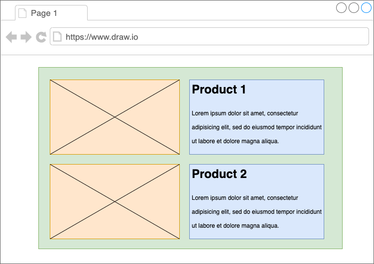

# Components and Props: Assessment

## Brief

Demonstrate your understanding between class and functional component by reproducing a nested component as shown in the picture below.

1. Green Section - a class component that contains the state (product 1 and product 2). 
2. Orange Section - a functional component for product image. 
3. Blue Section - a description component to display product title and product details.
4. You are to pass the data from parent component to child component, including the URL of the image.

## Submission Guidelines

- Cite any relevant sources consulted during your research
- Solve the problems using your own code
- Do not copy and paste solutions from the source material
- Submit your assignment to black board.