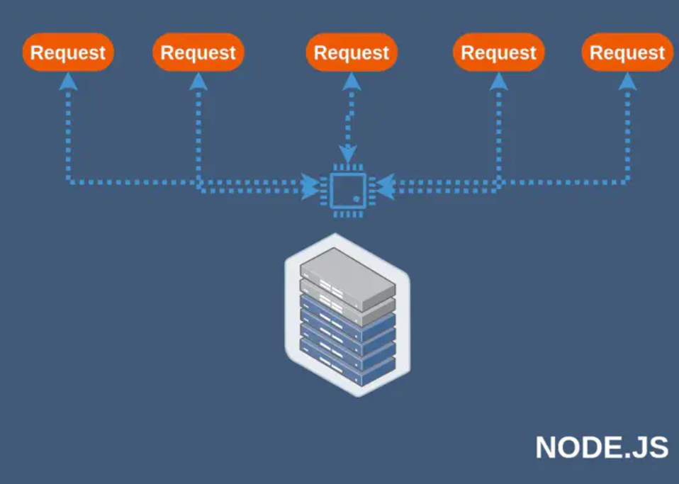

# Intro to Node.js: Assignment

## Brief

In your group, research and give a detailed response to this question: `Why is Node.js not suitable for CPU-intensive work?`

Discuss your answer with classmates in the last 45 minutes of the assignment session. Your instructor may challenge your answers, so be sure to give a strong defence on your point.

```
Single-Threaded
Node’s event loop uses a single-threaded implementation when handling events. Each event is handled one after another in the order they arrive by a single processor thread. The requests received to a Node web server are served in the order they were received.

To understand the significance of a single-threaded implementation, you have to understand how a multi-threaded implementation works.

A multi-threaded program has a pool of threads that run concurrently to accept requests. The number of threads used by the program is limited by the system’s RAM or other parameters. So, the number of requests it can process at a given time is limited to this number of threads. Whereas the single-threaded Node.js program can process any number of requests at a given time that are in the event queue to be executed.




Node’s single-threaded nature makes programs highly scalable. You can use the same program that is built to handle a limited number of requests to handle a much larger number of requests. Scaling a multi-threaded application calls for more system resources (like RAM) to increase the number of threads in the thread pool.
However, there is a downside to Node.js being single-threaded. The single-threaded implementation makes Node a bad choice for CPU-intensive programs. When a time-consuming task is running in the program it blocks the event loop from moving forward for a longer period. Unlike in a multi-threaded program, where one thread can be doing the CPU-intensive task and others can handle arriving requests, a Node.js program has to wait until the computation completes to handle incoming requests.

Node.js introduced a workaround for this problem in version 10.5.0: worker threads. You can read up more on this topic to understand how to use worker threads to solve this problem for CPU-intensive programs.

Reference: https://livecodestream.dev/post/when-you-should-and-should-not-use-nodejs-for-your-project/


Node is flawless if we are having asynchronous tasks because javascript will run these things by worker pool. But if we run CPU intense tasks(where we heavily use CPU ) e.g we have a billion users and we want to sort those people on name. It's quite an Intense tasks, and this is synchronous which will block other code from running.

Reference: https://newbedev.com/why-is-node-js-not-suitable-for-heavy-cpu-apps


A simple Node.js server is single-threaded, meaning that any operation that takes a long time to execute will block the rest of your program from running. Node.js apps manage to maintain a high level of concurrency by working as a series of events. When an event handler is waiting for something to happen (such as reading from the database), it tells Node to go ahead and process another event in the meantime. But since a single thread can only execute one instruction at a time, this approach can't save you from a function that needs to keep actively executing for a long time.

Reference: https://stackoverflow.com/questions/16974557/why-is-node-js-not-suitable-for-heavy-cpu-apps
```

## Submission Guidelines

- Cite any relevant sources consulted during your research
- Solve the problems using your own code
- Do not copy and paste solutions from the source material
- Submit your assignment to black board.
