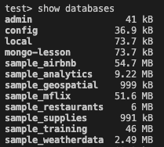

# Introduction to MongoDB: Assignment

## Brief

In most of the scenario that utilizes MongoDB, there are little update and delete operations but more bulk insertion and queries. In this assignment, we will explore on complex queries. Since MongoDB stores unstructured data in the form of documents, the query we write may not be as systemized as compared to SQL.

Follow the instruction below to load sample file provided by MongoDB. 

### Download and Load Sample Data

Download [this sample file](https://atlas-education.s3.amazonaws.com/sampledata.archive) to your directory.

Import the file into local MongoDB instance with the following command on Terminal:

```
mongorestore --archive=<path to sample file>
mongorestore --archive="C:\Users\Jane Lim\Documents\GitHub\SGUS-SDI\Module 4 - Full-stack Development\Assignment 2 - Mongo Intro\assignment2sampledata.archive"
```

Example if you are on the same directory as sample file:

```
mongorestore --archive=sampledata.archive
```

Once you are down, login to MongoDB session with `mongosh`.

Run the following command in `mongosh` and you will see all existing databases:

```
show databases
```

Sample Output:



Run the following command to choose the database you are going to work with:

```
use sample_restaurants
```

Output:

```
switched to db sample_restaurants
```

Run the following command to view all collections within the selected database:

```
show collections
```

Output:
```
neighborhoods
restaurants
```

Perform a `find()` query with `db.restaurants.find()` and you will receive an output containing the JSON Array.

---

## Working on Queries

Attempt the following queries.

### 1. List distinct cuisine
***db.restaurants.distinct("cuisine")***
```
[
  'Afghan',
  'African',
  'American',
  'Armenian',
  'Asian',
  'Australian',
  'Bagels/Pretzels',
  'Bakery',
  'Bangladeshi',
  'Barbecue',
  'Bottled beverages, including water, sodas, juices, etc.',
  'Brazilian',
  'Café/Coffee/Tea',
  'Café/Coffee/Tea',
  'Cajun',
  'Californian',
  'Caribbean',
  'Chicken',
  'Chilean',
  'Chinese',
  'Chinese/Cuban',
  'Chinese/Japanese',
  'Continental',
  'Creole',
  'Creole/Cajun',
  'Czech',
  'Delicatessen',
  'Donuts',
  'Eastern European',
  'Egyptian',
  'English',
  'Ethiopian',
  'Filipino',
  'French',
  'Fruits/Vegetables',
  'German',
  'Greek',
  'Hamburgers',
  'Hawaiian',
  'Hotdogs',
  'Hotdogs/Pretzels',
  'Ice Cream, Gelato, Yogurt, Ices',
  'Indian',
  'Indonesian',
  'Iranian',
  'Irish',
  'Italian',
  'Japanese',
  'Jewish/Kosher',
  'Juice, Smoothies, Fruit Salads',
  'Korean',
  'Latin (Cuban, Dominican, Puerto Rican, South & Central American)',
  'Mediterranean',
  'Mexican',
  'Middle Eastern',
  'Moroccan',
  'Not Listed/Not Applicable',
  'Nuts/Confectionary',
  'Other',
  'Pakistani',
  'Pancakes/Waffles',
  'Peruvian',
  'Pizza',
  'Pizza/Italian',
  'Polish',
  'Polynesian',
  'Portuguese',
  'Russian',
  'Salads',
  'Sandwiches',
  'Sandwiches/Salads/Mixed Buffet',
  'Scandinavian',
  'Seafood',
  'Soul Food',
  'Soups',
  'Soups & Sandwiches',
  'Southwestern',
  'Spanish',
  'Steak',
  'Tapas',
  'Tex-Mex',
  'Thai',
  'Turkish',
  'Vegetarian',
  'Vietnamese/Cambodian/Malaysia'
]
```

### 2. List restaurants name where cuisine is "Turkish" 
***db.restaurants.aggregate([ {$match: {cuisine:"Turkish"} }, {$sort: {name:1}}, { $group: { _id: null, restaurantsName: {$push:"$name"} } } ]);***
```
[
    'Aba Turkish Restaurant',
    'Adana Grill',
    'Agora Turkish Restaurant',
    'Akdeniz',
    'Aksaray Turkish Cafe And Restaurant',
    'Ali Baba Restaurant',
    "Ali Baba'S",
    'Anatolian Gyro Restaurant',
    'Anka Grill',
    'Antalia Turkish Cuisine',
    'Babylon',
    'Beyti Turkish Kebab',
    'Black Sea Fish & Gr',
    'Cocoa Grinder',
    'Francela',
    'Garden Kebab House',
    'Gulluoglu Baklava & Cafe',
    'Gulluoglu Baklava & Cafe',
    'Gyro Cafe',
    'Hanci Turkish Cuisine',
    'Hazar Turkish Kebab',
    'Istanbul',
    'Istanbul Grill',
    'Istanbul Kebab House',
    'Istanbul Kitchen',
    'Istanbul Park',
    'Istanbul Restaurant',
    'Kebab House',
    'Kestane Kebab',
    'Kofte Piyaz Restaurant',
    "L' Chaim Cafe",
    'Limon',
    'Little Rascal',
    'Mangal Kebab Turkish Restaurant',
    'Masal Cafe & Lounge',
    'Memo Shish Kebab',
    'Mmenfes Turkish Food',
    'Opera Cafe Lounge',
    'Orient Express',
    'Papa Gyro',
    'Pasha Turkish Restaurant',
    'Pashazade',
    'Pera Soho',
    'Pierre Loti Cafe & Wine Bar',
    'Roka Turkish Cuisine',
    'Sahara Restaurant',
    'Saharas Turkish Cuisine',
    'Seaside Turkish Mediterranean Restaurant',
    'Seven Turkish Grill',
    'Simit And Smith',
    'Simit Sarayi',
    'Sip Sak',
    'Sofra Cafe',
    "Taci'S Authentic Turkish Restaurant",
    "Taci'S Beyti Restaurant",
    'Taksim',
    'Taksim Square 2',
    'Taksim Square 3',
    'The Country Cafe',
    'Troy Turkish Grill',
    'Troy Turkish Grill',
    'Tsob-Tsobe Cafe Lounge Bar',
    'Turkish Cuisine',
    'Turkish Express',
    'Turkish Grill Restaurant & Bar',
    'Turkish Kebab House',
    'Turkish Kitchen',
    'Turkiss',
    'Turkuaz Turkish Cuisine',
    'Uskudar Restaurant'
]
```

### 3. List restuarants where `grade` is equals to `C`
***db.restaurants.aggregate([ {$match: {"grades.grade":"C"} }, {$sort: {name:1}}, { $group: { _id: null, restaurants: {$push: "$name"} } } ]);***
```
[
    '#1 Sabor Latino Restaurant',
    '1 Banana Queen',
    '102 Noodles Town Restaurant',
    '1020 Bar',
    '121 Fulton Street',
    '137 Bar & Grill',
    '15 East Restaurant',
    '16 Handles',
    '169 Bar',
    '18 Chinese Cuisine',
    '1St Avenue Gourmet',
    '200 Fifth Avenue Restaurant & Sports Bar',
    '2058 Deli And Grocery',
    '216 Good Joy Chinese Restaurant',
    '218 Restaurant',
    '230 Fifth',
    '374 Deli',
    '38Th Street Diner',
    '40/40 Club',
    '44 1/2 Cafe',
    '456 Restaurant',
    '5 Avenue Asian Taste',
    '5 Estrella Bakery',
    '508 Restaurant And Bar',
    '525 Lex Restaurant & Bar',
    '67 Burger',
    '706 Bar',
    '71 Irving Place',
    '773 Lounge',
    '7Th Avenue Donut Shop',
    '805 Zheng Yuan Bao Gourmet',
    '85 Chinese Restaurant',
    '88 Palace Restaurant',
    '940 Flushing Lounge/Arancini Bros',
    '99 Cent Express Pizza',
    'A Chiban',
    'A Slice Of New York',
    'A Wai Lou Restaurant',
    'A&E Tenochtitlan Deli & Taqueria',
    'A+ Lollipop',
    'A-1 Pizza Shop',
    'A-Wah Restaurant',
    'A. Churrasqueira Restaurant',
    'A.G Kitchen',
    'A.J. Pizzeria',
    "Aa Admiral'S Club Lounge",
    'Aa Chinese Resturant',
    'Aa Jing',
    'Aangan',
    'Aarons Chinese & Thai Restaurant',
    'Abdullah Sweets And Restaurant',
    "Abitino'S Pizza",
    'Abottega',
    'Absolute Bagels',
    "Abu'S Homestyle Bakery",
    'Academy Restauraunt',
    'Acappella Restaurant',
    'Accra Restaurant',
    'Ace Hot Bagel & Deli',
    "Acey Ducey'S",
    'Acqua',
    'Acquista Trattoria',
    'Adam Chinese Cottage',
    'Aden Restaurant',
    'Admirals Club Conc C',
    'Adobe Blues',
    'Adriatic Restaurant Pizzeria Bar',
    'Aegea Gyros And Pizza',
    'Afghan Kebab House #1',
    'Agoda Asian Cuisine',
    'Agra Heights',
    'Agra Restaurant',
    'Ahi Sushi',
    'Ahuachapan',
    'Ai Zhen Foo Chow Restaurant',
    'Aiko Sushi Japanese Restaurant (Jinshu Sushi)',
    'Ajisai Japanese Restaurant',
    'Aki Sushi',
    'Aki Sushi & Grill',
    'Akimoto Sushi',
    'Al Dente Pizzeria',
    'Al-Dente',
    'Al-Rahamania Restaurant And Catering',
    'Albella Ristorante & Bar',
    'Albion',
    'Aldea Restaurant',
    'Alewife',
    'Alexandra',
    "Alfonso'S Bar",
    'Alices Tea Cup Chapter 2',
    "All'Onda",
    'Alobar Restaurant',
    'Alpha Fusion',
    "Alton'S Pizza & Deli",
    'Am',
    'Am Thai Bistro',
    'Aman Restaurant',
    'Amanecer Latino Restaurant',
    'Amazing 66 Restaurant',
    'Ambar',
    'Amc Theatres 84Th Street',
    'Amc Theatres Fresh Meadows 7',
    "Amelia'S Restaurant",
    'America Gourmet Food',
    'American & Latin Cuisine',
    'American Airlines Employee Cafeteria',
    'American Hero Express',
    'Amici 36',
    'Amnon Kosher Pizza',
    'Amsterdam Ale House',
    'Amsterdam Restaurant & Tapas Lounge',
    'Amuse Wine Bar',
    "Amy'S Bread",
    'Andres Carne De Tres',
    'Andrews Coffee Shop',
    "Andy'S Deli",
    'Anella',
    "Angel'S 1 Bakery",
    'Angela Cake',
    'Angelita Restaurant',
    "Angelo'S Pizza",
    "Angelo'S Pizza",
    "Angelo'S Pizzeria",
    'Angelos Deli Restaurant',
    "Angie'S Cafe Pizza",
    "Annie Chan'S Restaurant",
    'Antalia Turkish Cuisine',
    'Antibes Bistro',
    'Antica Bottega Del Vino',
    'Antojitos Deli Food',
    'Antojitos Mexicanos',
    "Antonio'S",
    "Antonio'S Pizza",
    "Antonio'S Pizzeria",
    'Anyway Cafe',
    'Anyway Cafe Bar',
    'Aoa Bar & Grill',
    'Aoyama Sushi',
    'Apollo Bakery',
    'Applewood',
    'Apt. 78',
    'Ar Restaurant & Catering',
    'Arabelle',
    'Arbor Bistro',
    'Aria',
    "Ariana'S Catering Hall",
    'Arirang Hibachi Steakhouse',
    'Arirang Usa',
    'Ariyoshi Japanese Restaurant',
    'Arkansas Fried Chicken',
    'Aroma',
    'Arome',
    'Arriba Arriba',
    'Arte Around The Corner',
    'Arte Cafe',
    'Artichoke Pizza & Brewery',
    "Arturo'S Pizza",
    'Asari Sushi/Aj 36 Chinese Cuisine',
    "Ashby'S",
    'Asia Dog',
    'Asian Express',
    'Asian Station',
    'Asif Super Kennedy Fried Chicken',
    'Asya Indian Restaurant',
    'Atera',
    'Atomic Wings',
    'Auction House',
    'Austin House',
    'Automatic Slims',
    'Avenue P Appetizer',
    'Azteca Maya Restaurant',
    'Azuki Japanese Restaurent',
    'Azylum Bar & Lounge',
    'B & B Restaurant Ii',
    'B & M Hot Bagel & Grocery',
    'B And B Restaurant',
    'B Bo Sing Bakery',
    'B&W Deli Grocery',
    "B'Klyn'S Pizza Joint",
    'B-Hive Lounge',
    'B.B. Kings',
    'B.B.Q. Village Palace',
    'Babalu',
    'Babylon',
    'Bacchus',
    'Back To Nature',
    'Bad Burger',
    'Bagatelle',
    'Bagel Land',
    'Bagelberry',
    'Bagels & Co.',
    'Bagels On The Island',
    'Bagels R Us',
    'Bagelsmith',
    'Bagelteria',
    'Bahar Masala',
    'Bakery',
    'Bakery Rzeszowska',
    'Bakeway Nyc',
    'Bakhter Afghan Halal Kabab',
    'Balade',
    'Balcon Quiteno Restaurant',
    'Bali Nusa Indonesian Restaurant',
    'Balimaya Restaurant',
    'Ballaro',
    'Bally Total Fitness',
    'Balon',
    "Baluchi'S",
    "Baluchi'S Indian Food",
    'Bamboo Garden',
    'Bamboo Garden Restaurant',
    'Bamboo Restaurant',
    'Bangia Bar & Lounge',
    'Bangkok House',
    'Bankok Cuisine',
    'Banquet Kitchen (Marriott)',
    'Bao Ding',
    'Baoguette Pho Sure',
    'Baohaus',
    'Bar & Grill 43',
    'Bar 13',
    'Bar Corvo',
    'Bar Matchless',
    'Bar Mishima',
    'Bareburger',
    "Bari'S Pizza & Pasta Restaurant",
    'Barking Dog',
    'Barone Pizza',
    'Barracuda Bar',
    'Bartow Pizza',
    'Baruch College',
    'Basso56',
    'Basurero',
    'Bawarchi Indian Cuisine',
    'Bay Leaf',
    'Bay Terrace Pool & Tennis Center',
    'Bbq Village',
    'Bcd Tofu House',
    'Bds Bakery',
    'Beach Street Eatery',
    "Beckett'S",
    'Bel-Aire Diner',
    'Belaire Cafe',
    'Belfry',
    'Bella Donna Cafe',
    'Bella Napoli',
    'Bella Pizza',
    'Bella Roza',
    'Bella Vita',
    "Bella'S Place",
    'Bellini Restaurant',
    'Bello Giardino',
    'Belvedere Restaurant',
    'Ben & Jacks Steakhouse',
    'Benares Indian Food',
    'Bene Pizzeria And Restaurant',
    'Benevento Pizzaria & Grill',
    'Bengal Food',
    "Beni'S Restaurant & Bar",
    'Benito One',
    "Benny'S",
    'Benton',
    'Benton Cafe',
    'Bergen Pizza',
    'Bermay Luncheonette',
    'Best Bakery',
    'Best Buy Theater',
    'Best Coffee Shop',
    'Best Fuzhou Restaurant',
    'Best Pizza On 1St.',
    'Bg Bar/Mehanata',
    'Bg Restaurant',
    'Big Arc Chicken',
    'Big Hing Wong Restaurant',
    "Billy'S Bakery",
    "Billy'S Sport Bar Restaurant & Lounge",
    'Bismillah Kabab & Curry',
    'Bistro Caterers',
    'Bk Sushi',
    "Bklyn'S Tiki Bar",
    'Blacksmith Cafe & Delicatessen',
    'Blarney Stone',
    'Blaue Gans',
    'Bleecker Deli & Grill',
    'Blend',
    'Blind Barber',
    'Blinks Deli',
    'Blk Mkt',
    'Blondies',
    'Blossom Du Jour',
    'Blossom Du Jour',
    'Blue Dish Cafe',
    'Blue Dog Cafe',
    'Blue Note Jazz',
    'Boardwalk Pizzeria Restaurant',
    'Bob Bar',
    "Bob'S Discount Furniture",
    'Boba Life',
    "Bobby Van'S Steakhouse",
    "Bobby'S Coffee Shop",
    'Bocaditos',
    'Bocca',
    'Bocelli',
    'Bodhi Tree',
    'Bohemian New York',
    'Bombay Curry',
    'Bombay Heights',
    'Bombay Junction',
    'Bombay Masala',
    'Bombayduck Co.',
    'Bon Chon',
    'Boon Chu Thai Restaurant',
    'Bosie Tea Parlor',
    'Boston Jerk-City Restaurant',
    'Bourbon Street',
    'Bowery Eats (Bowery Kitchen Appliance)',
    'Bowlmor Chelsea Piers',
    'Bp / Turkam',
    'Braai',
    "Brad'S Cafe",
    'Brasserie Cognac',
    'Bread',
    'Bread & Butter',
    'Bread & Company',
    'Bread Talk',
    'Breadzone',
    "Breeze'S Jamaican Restaurant & Bakery",
    'Breuckelen Colony',
    "Brick Pizzeria/Nathan'S Famous Hot Dogs",
    'Brisas Del Mar Seafood Market',
    'Broadway Chinese Seafood',
    'Broadway Restaurant',
    'Bronx Grill',
    'Bronx Pizza',
    'Brooklyn Buschenschank',
    'Brooklyn Farmacy And Soda Fountain',
    'Brooklyn Moon Cafe',
    'Brooklyn National Deli',
    'Brooklyn Pizza',
    'Brooklyn Pizza Ii',
    'Brothers Bubble Tea',
    'Brothers Fish Market',
    'Brothers Pizza',
    'Bruno Ravioli',
    'Bubble Crepe',
    "Bubby'S Highline",
    'Buffalo Wild Wings,Peets Coofee &Tea, Panopolis Bakery & Cafe',
    'Building On Bond',
    'Buka',
    'Bungalo',
    'Burger King',
    'Burger King',
    'Burger King',
    'Burger King',
    'Burger King',
    'Burger King',
    'Burger King',
    'Burger King',
    'Burger King/Metro Mall',
    'Burgos Restaurant',
    'Butcher Gourmet Deli',
    'Butter Lane',
    'Buttermilk Bar',
    'Byung Chun Soon Dae',
    'C & L Of East Ocean Restaurant',
    'C & M Pizza',
    "C J'S Bar & Lounge",
    "C'Est Bon Cafe",
    'C-Pac/Pulse 48',
    'Cadaques',
    'Cafe 104',
    'Cafe 22',
    'Cafe 45',
    'Cafe 71',
    'Cafe 75 Bar',
    'Cafe Afsona',
    'Cafe Asean',
    "Cafe B'Way 46",
    'Cafe Blossom',
    'Cafe Bravo',
    'Cafe Cambodge',
    'Cafe Centro',
    'Cafe Champignon',
    'Cafe Chili',
    'Cafe Con Leche',
    'Cafe Condesa',
    'Cafe Cousina Restaurant',
    'Cafe Daniellos Pizzeria Restaurant',
    'Cafe Del Sol',
    'Cafe Duke',
    'Cafe El Puente Restaurant',
    'Cafe Espanol',
    'Cafe Espanol',
    'Cafe Exchange',
    'Cafe Green',
    'Cafe Hadar',
    'Cafe Kafeneja Jone Lounge',
    'Cafe La Morena & Deli',
    'Cafe Luna',
    'Cafe Omar/Patty Palace',
    'Cafe Originale',
    'Cafe Pashtriku',
    'Cafe Pick Me Up',
    'Cafe R',
    'Cafe Ronda',
    'Cafe Savoy Bakery',
    'Cafe Select',
    'Cafe Un Deux Trois',
    'Cafe Water',
    'Cafe Wha?',
    'Cafe Zaiya',
    'Cafeteria (Usps Bldng)',
    "Caffe Azzurri D'Italia",
    'Caffe Cafe',
    'Caffe Dante',
    'Caffe Napoli',
    'Caffe Palermo',
    'Caja Musical',
    'Cake House Win',
    'Campeon',
    'Cana Restaurant & Catering',
    'Canarsie Coffee',
    'Cancun Mexican Restaurant',
    'Candle Bar',
    'Canoa',
    'Cantine Parisienne',
    'Capri Ii Pizza',
    'Careta Bar & Restaurant',
    "Caribbean Jerkee'S Delight",
    'Caridad Restaurant',
    "Carmine'S Original Pizza",
    "Carol'S Bun",
    'Casa Asia',
    'Casa Del Salmon #2',
    'Casa Mezcal',
    'Casa Vieja Restaurant',
    "Cascarino'S",
    'Casella Bagel Coffee Shop',
    'Casellula Cheese & Wine Cafe',
    'Cask Bar & Kitchen',
    'Castillo De Jagua Deli Restaurant',
    "Castro'S Restaurant",
    'Catacocha Restaurant',
    "Cathy'S Place Diner",
    'Cava Wine Bar',
    'Ceci Restaurant',
    'Celebrate At Snug Harbor',
    'Cemitas Puebla Restaurant',
    'Centra`L Market All American Grill ( Staten Island Ferry Terminal)',
    'Central American Restaurant',
    'Central Cafe',
    'Century Super Buffet',
    'Ceol',
    'Certe Catering',
    'Cervantes Restaurant',
    "Cestra'S Pizza",
    "Cha Cha'S Backyard Garden Bar & Cafe",
    'Cha Chan Tang',
    'Chabba Bbq/ Family Grill & Cuisine',
    'Chal Chilli',
    'Chandni Restaurant',
    'Changle Xin Fan Zhuang',
    'Chao Thai Too',
    'Charlotte Restaurant Bar & Lounge',
    'Chartwells @ Manhattan School Of Music',
    'Chatham Square Restaurant',
    'Chautari Restaurant',
    'Cheburechnaya',
    'Checkpoint Ben Cafe',
    'Cheesy Pizza',
    "Chef Ho'S",
    'Chef Yu / Azuki',
    "Chef'S Secret",
    'Cheikh Umar Futiyu Restaurant',
    'Chelsea Square Restaurant',
    'Chen Kong Chinese Restaurant',
    'Chen Won Dim Sum & Bakery',
    'Chen Wong Restaurant',
    "Chen'S Garden",
    'Chennai Garden',
    'Cheong Hei Restaurant',
    'Cheri',
    'Cherry Valley Deli',
    "Cheryl'S Global Soul",
    'Chevys Fresh Mex',
    'Chez Josephine',
    'Chicken Delicatessen',
    'Chickpea',
    'Chifa Restaurant',
    'Chiflez',
    'Chikurin',
    'Chikurin Japanese Restaurant',
    'Chili Basil Amma Thai',
    "Chili'S Grill & Bar",
    'Chimu',
    'China Bar',
    'China Chalet',
    'China Garden Chinese Restaurant',
    'China Glatt',
    'China Gourmet',
    'China King',
    'China King Restaurant',
    'China Moon',
    'China New Star',
    'China Pearl Seafood Restaurant',
    'China Sun',
    'China Sun',
    'China Taste',
    'Chinar On The Island',
    'Chinatown Restaurant',
    'Chinese Musician Restaurant',
    'Chip Shop',
    'Chipichape Colombian Bakery',
    'Chipotle Mexican Grill',
    'Chipotle Mexican Grill',
    'Chips & Salsa',
    'Chocolat',
    "Chole'S Restaurant & Lounge",
    'Cholulita Deli & Restaurant',
    "Chop'T",
    'Chopita',
    'Chopstix Restaurant',
    "Christie'S Pub",
    "Chu'S Gourmet",
    "Chuck E Cheese'S",
    "Chuck E Cheese'S",
    "Chuck E Cheese'S",
    "Chui'S Garden",
    'Chung Chun Kitchen',
    'Chung Hing Chinese Restaurant',
    'Cinderellas Restaurant',
    'Circle West Diner',
    'Ciro Pizza',
    'Citi Bagel & Deli',
    'Citrus Bar & Grill',
    'City Cafe',
    'City College Marshak Cafe',
    'City Crab',
    'City Restaurant',
    'City Snooker Pool House',
    'City Tech Bookstore & Cafe',
    'Clarion Hotel At Laguardia',
    'Classic Kosher Catering',
    'Claypot (Food Court, #23)',
    'Cloister Cafe',
    'Club A Steakhouse',
    'Club Gera Gera',
    'Clubs Gyro',
    'Coatzingo Restaurant',
    'Coccola',
    'Coco Roco Restaurant',
    'Coco South Malaysian Cuisine',
    'Cocoron',
    'Coffee Shop Diner',
    'Coffee Spot Cafe',
    'Cold Stone Creamery',
    'Colgate Palmolive',
    'Colombia Fama Bakery',
    'Colombus Ave Deli & Cofe',
    'Colony Fried Chicken',
    'Columbus Gourmet Food',
    'Comic Strip',
    'Como Pizza',
    'Concon Cafe',
    'Concord Garden Restaurant',
    'Concourse Jamaican Bakery',
    'Concrete Restaurant',
    'Cong Ly Restaurant',
    'Connecticut Muffin',
    'Conrad Famous Bakery',
    'Copacabana',
    'Coppelia Cuban Luncheonette',
    "Coppola'S",
    "Coral'S Lp Bar Restaurant",
    'Corona Pizza',
    'Costa Verde',
    'Cotton Club',
    'Country Thyme Cuisine',
    'Cozy Bowl Lounge',
    'Cozy Corner Bar & Restaurant',
    'Crave Sandwiches',
    'Creole 516 ',
    'Crescent Coffee Shop',
    "Crispin'S Hell'S Kitchen",
    'Crispy & Tasty',
    'Cristina Deli',
    'Crocodile Lounge',
    'Cross Bronx Pizzeria',
    'Cross Culture Kitchen',
    'Crossroads (Marriott Marquis)',
    'Crown Chicken Pizza & Coffee Shop',
    'Crown Fried Chicken',
    'Crown Fried Chicken',
    'Crown Fried Chicken',
    'Crown Fried Chicken',
    'Crown Fried Chicken',
    'Crown Fried Chicken',
    'Crown Fried Chicken',
    'Crown Fried Chicken',
    'Crown Fried Chicken',
    'Crown Fried Chicken',
    'Crown Fried Chicken',
    'Crown Fried Chicken & Pizza',
    'Crown Fried Chicken And Mediterranean Grill',
    'Crown Grill & Salad',
    'Crown Heights Bunch-O-Bagels And More',
    'Crown Ktv',
    'Crown Palace Restaurant',
    'Crystal Curry House',
    'Crystal Manor',
    'Crystal Palace',
    'Cu29 Copper Restaurant',
    'Cuenca Coffee Shop Restaurant',
    "Cupido'S Restaurant",
    'Cupola Samarkanda',
    'Curry & Kabab',
    'Curry Heaven',
    'Curry Heights',
    'Curry In A Hurry',
    'Curry Kabab',
    'Curry King',
    'Curry Leaves Restaurant',
    "Curves Gentleman'S Club",
    'Cutting Board',
    'D & P Restaurant & Cocktail',
    'D & S Bakery',
    'D & Y Restaurant',
    'D And G Pizzeria And Rotisserie',
    "D'Angelo'S Pizza",
    "D'Angelo'S Pizza And Pancho'S Mexican Restaurant",
    "D'Angie Restaurant",
    "D'Vida Health Bar",
    'D.M Tea',
    'Da Marino Restaurant',
    "Dada'S Coffee Shop",
    'Dae Dong Manor',
    'Dae Jang Geum',
    'Dagan Pizza & Dairy Restaurant',
    'Dai Wah Yummy City',
    'Dali Market',
    "Dan'S Bakery & Roti House",
    "Dangerfield'S Night Club",
    "Danny'S Deli",
    "Danny'S Pizzeria & Cafe",
    "Danny'S Tasty Tips",
    "Dany'S Pizza Restaurant",
    'Dar 525',
    'Dark Room',
    'Daruma-Ya /Sushi Azabu',
    'David Pizzeria',
    "David'S Restaurant",
    'Dd Bakery',
    'De La Vega Restaurant',
    'De Robertis Pastry Shop',
    'Dean & Deluca',
    'Death & Co',
    'Delhi Heights',
    'Deli Express',
    'Delicias Cuencanas Bar-Restaurant Deli,',
    'Delicious Bakery',
    'Delicious Juice Bar',
    'Delis 48',
    "Delroy'S Cafe",
    'Deluge Restaurant',
    'Desmonds Steakhouse And Grill',
    'Dhaba Indian Cuisine',
    'Di Yuan Karaoke',
    'Diamond Krust',
    "Dick And Jane'S",
    'Dieci',
    'Dinastia China',
    'Division 31 Restaurant',
    'Diy Billiards',
    "Dizzy'S Restaurant",
    'Doc Wine Bar',
    'Dock Street Bar & Grill',
    'Dolphins Diner',
    'Dominican Food R. A. Deli',
    "Dominick'S Pizza",
    "Domino'S Pizza",
    "Domino'S Pizza",
    "Domino'S Pizza",
    "Domino'S Pizza",
    "Domino'S Pizza",
    "Domino'S Pizza",
    "Domino'S Pizza",
    "Domino'S Pizza",
    "Domino'S Pizza",
    "Domino'S Pizza",
    'Dominos Pizza',
    'Don Alex Restaurant',
    'Don Alex Restaurant',
    'Don Alex Restaurant',
    'Don Antonio Restaurant',
    'Don Francisco Restaurant',
    'Don Paco  Lopez Panderia',
    'Don Pedro Restaurant',
    'Don Peppe',
    'Don Pichon Restaurant',
    'Don Sabor Dominican Restaurant',
    'Dong Chun Hong Chinese Restaurant',
    "Donut Connection/Hershey'S Ice Cream",
    "Doro'S Jamaican Restaurant",
    'Double Happy Restaurant',
    'Doubletree Greenhouse 36',
    'Dovetail',
    'Down Town Association',
    'Downtown Bakery Ii Mexican Food',
    'Dragon House',
    'Dram Shop',
    'Dream Pizza',
    'Drom',
    'Due Fratelli Pizza',
    'Dugout Pub',
    'Dunhill Cafe',
    'Dunkin Donuts',
    'Dunkin Donuts',
    'Dunkin Donuts',
    'Dunkin Donuts & Baskin Robbins',
    'Dunkin Donuts Baskin Robbins',
    "Dunkin' Donuts",
    "Dunkin' Donuts",
    "Dunkin' Donuts",
    "Dunkin' Donuts",
    "Dunkin' Donuts, Baskin Robbins",
    "Dunkin' Donuts, Baskin Robbins",
    "Dunkin' Donuts, Baskin Robbins",
    "Dunkin' Donuts, Baskin Robbins",
    "Dunkin' Donuts/Baskin' Robbins",
    'Duo Tian Bakery',
    'Dyckman Express Restaurant',
    'Dynasty',
    'Dynasty Restaurant',
    'E-Dah Korean Bbq Lounge',
    'Earl Of Sandwich',
    'East Broadway Pizza & Fried Chicken Restaurant',
    'East Broadway Restaurant',
    'East Japanese Restaurant',
    'East Japanese Restaurant/ Bar',
    'East Market Restaurant',
    'East Side Bagel Cafe',
    'East Side Billard',
    'East Star Chinese Restaurant',
    'East Town',
    'East Village Pizza And Kebab',
    'Eastend Bar & Grill',
    'Eat Here Now',
    'Eat On 8Th',
    'Eclipse On The Boulevard',
    "Eddie'S Sweet Shop",
    'Edi & The Wolf',
    'Edin Food And Bakery',
    'Edison Restaurant',
    'Egyptian Coffee Shop',
    'El Acatlan Mexican Restaurant',
    'El Aguila',
    'El Ancla De Astoria Restaurant & Bar',
    'El Anzuelo Fino',
    'El Arca Restaurant & Grill',
    'El Azteca Mexican Restaurant',
    'El Born',
    'El Buen Ambiente',
    'El Campeon De Los Pollos Restaurant',
    'El Canelazo Bar Restaurant',
    'El Cantinero',
    'El Capri Restaurant',
    'El Caribe Restaurant',
    'El Chalaco Restaurant Peruano',
    'El Charrito Junior',
    'El Chicanito Sports Bar',
    "El Chivito D'Oro Iii",
    'El Cibao Diner',
    'El Conquistador Restaurant',
    'El Continental Restaurant',
    'El Despertar Marlene',
    'El Diamante Restaurant',
    'El Dorado',
    'El Dorado Restaurant',
    'El Eden Empanadas & Nat. Juices',
    'El Encuentro Restaurant Bar & Lounge',
    'El Fogon Costeno Restaurant.',
    'El Huequito Restaurant',
    'El Izalco Restaurant',
    'El Jobo Restaurant',
    'El Kayam',
    'El Lider Restaurant',
    'El Lina Restaurant',
    'El Maguey Y La Tuna',
    'El Manantial Bakery',
    'El Mangu Sabroso Restaurant',
    'El Mixteco',
    'El Molino Rojo Restaurant',
    'El Monstro Del Sazon Restaurant Pizzeria',
    'El Monumental Restaurant',
    'El Nuevo Amanecer Restaurant',
    'El Nuevo Bohio Restaurant',
    'El Nuevo Caribeno Restaurant',
    'El Nuevo Jb Bakery',
    "El Nuevo Pollo'S Sabroso",
    'El Nuevo Portal Restaurant',
    'El Nuevo Sabor Latino',
    'El Nuevo Sandy Restaurant',
    'El Nuevo Valle #2 Restaurant Lechonera',
    'El Nuevo Yauco Restaurant',
    'El Nuevo Yoly Restaurant',
    'El Pachangon Iii Restaurant & Bar',
    'El Paraiso',
    'El Paraiso Bar & Restaurant',
    'El Patio',
    'El Pesao Sazon',
    'El Pollito Mexicano',
    'El Pollo Inka Peru',
    'El Pollo Restaurant And Bar',
    'El Porron',
    'El Potrero Sport Bar',
    'El Puerto De Acapulco',
    'El Rancho Los Compadres',
    'El Rey Ii Restaurant',
    'El Rey Iii',
    'El Rico Tinto Bakery',
    'El Rincon De La Vieja Bakery And Restaurant',
    'El Sabroso Restaurant',
    'El Salvador Restaurant',
    'El Sol Restaurant',
    'El Tapatio Mexican Restaurant',
    'El Valle',
    'El Valle Restaurant',
    'El Vaquero Barras',
    'El Viejo Yayo Restaurant',
    'El Yayo Nuevo Restaurant',
    'El-Omda',
    'Element New York',
    "Elena'S Restuarant",
    'Elim Deli Cafe',
    'Elixir',
    'Elm Park Inn/Upper Crust Pizza',
    'Elsa La Reina Del Chicharron',
    'Elyne Restaurant',
    'Embers',
    'Emerald Pub',
    'Emergency Snack Bar',
    'Emilio Iii Bar',
    'Empire Bbq Restaurant',
    'Empire Express',
    'Empire Szechuan Kyoto',
    'Enthaice',
    'Envy',
    'Enzo Cafe',
    "Enzo'S Pizza",
    'Era Cafe And Lounge',
    'Erawan Thai Cuisine',
    'Erb',
    'Esperanto',
    'Essen',
    'Estrella Bar & Restaurant',
    'Europa Cafe',
    'Europan Bakery And Cafe',
    'Europan Cafe',
    'Everett',
    'Evergreen Restaurant',
    'Everyday Gourmet Deli',
    'Evr',
    'Exo',
    'Experimental Cocktail',
    'Express Brook Lunch Restaurant',
    'Exquisito Restaurant',
    'F.L.H. Seafood Restaurant',
    'Fairytales Lounge',
    'Fajitas Sunrise Restaurant',
    'Fallsburg Bagels',
    'Family Chef Restaurant',
    'Family Garden',
    'Famous Amadeus Pizza',
    "Famous Ben'S Pizza Of Soho",
    'Famous Famiglia Pizza',
    'Famous Restaurant Rotesserie Grill Taco And Chinese Food',
    'Far East Szechuan Kitchen',
    'Farmer Sports & Social Club',
    'Farmers Pizza & Grill',
    'Faro Del Pacifico Pupuseria And Restaurant',
    'Faros Restaurant',
    'Fashion 40',
    'Fat Baby',
    'Fat Buddha',
    'Fat Goose',
    "Fat Sal'S",
    'Fay Da Bakery',
    'Faye & King Jamaican Rest',
    'Feiteng Chinese Take Out Kitchen',
    'Feng Cheng Yuan Restaurant',
    'Feng Mao Bbq',
    'Fever Grass',
    'Fiddlesticks',
    'Fika',
    'Fiorentino Ristorante',
    'Fiorini',
    'First House Garden',
    'First Taste Bakery',
    'Fish Eye Bar & Grill',
    'Five Lamps Tavern',
    'Five Leaves',
    'Five Star Fish & Chips',
    'Five Stars Restaurant',
    'Five-O International Restaurant',
    'Flava Ii',
    'Flirt',
    'Flor De Mayo Restaurant',
    'Florencia 13',
    'Florinda Restaurant',
    'Fontana Sushi',
    'Food In Motion',
    'Forcella',
    'Forest Park Golf Course',
    'Forest Thai Cuisine',
    'Fork & Spoon',
    'Fort Defiance',
    'Fortuna',
    'Fortunato Bros Cafe & Bakery',
    'Fortune Cookie',
    'Fortune Cookies',
    'Four Seasons Bakery',
    'Four Seasons Hotel',
    'Four Seasons Jamaican Restaurant & Bakery',
    'Fourth Avenue Pub',
    "Francesco'S Pizzeria Restaurant",
    'Francisca Pizzeria Bagel Cafe',
    'Franco Bakery',
    'Franhill Deli',
    "Frank And Joe'S Deli",
    "Frank'S Lounge & Bar",
    "Frank'S Pizza",
    'Franklin Pizza',
    'Fratellis',
    'Fraunces Tavern',
    "Freda'S",
    "Freddie & Pepper'S Pizza",
    'Frederic Fekkai New York',
    'Free Time Hangout',
    'Fresco',
    'Fresh & Co.',
    'Fresh To You',
    'Fresh Tortillas & Taco',
    'Fresh Tortillas Taco',
    "Friend'S Pizza Cafe",
    'Friendly Restaurant',
    'Fritaye Five Star',
    'Front Toward Enemy',
    'Fu Hai Restaurant',
    'Fu Ke Lai Cuisine',
    'Fu Ran Restaurant',
    'Fu Xiang Ju',
    'Fu Xing House',
    'Fuego Royal Restaurant Bar',
    'Fuel Express',
    'Fuji Japanese Cuisine',
    'Fuji Japanese Restaurant',
    'Full Doe Bakery',
    'Fulton Grill',
    'Fulton Street Bagels',
    'Fusha',
    'Fusion Grills',
    "Gabriela'S Restaurante",
    "Gaetana'S Cucina Italiana",
    'Gahm Mi Oak Restaurant',
    'Gal Bi Ma Eul',
    'Gallo Nero',
    'Gallo Nero',
    'Gambrinus',
    'Gandhi',
    'Gang San Deul',
    'Gaonnuri',
    'Garden Grill',
    'Garden Of Eat-In',
    'Garlic Pizza Bar',
    'Gaslight',
    'Gate Way Beer Garden',
    "Gatsby'S",
    'Gee Whiz',
    "Gem & Joe Indian'S Eat And Drink Cafe",
    'Gen Restaurant',
    'Genie Hookah Lounge',
    "George'S",
    "George'S Restaurant",
    'Georges Restaurant',
    'Georges Restaurant',
    'Ghang Thai Kitchen',
    'Giacomo Fine Foods',
    "Gila'S Nosh",
    'Gina La Fornarina',
    "Gina'S Italian Bakery & Pastry Shop",
    'Ginger',
    'Ginger Grill',
    "Ginger'S Bar",
    "Gino'S Pizza",
    "Gino'S Pizza",
    "Gino'S Pizzeria",
    "Gino'S Pizzeria Restaurant",
    "Giovanni'S",
    "Giovanni'S",
    "Giovanni'S Restaurant",
    'Girasol Bakery',
    "Gleason'S",
    'Glow Thai Restaurant',
    'Gmc Temaxcal Deli & Grocery',
    "Gobo'S",
    'Golden Bowl Restaurant',
    'Golden Bun Bakery',
    'Golden Chicken',
    'Golden China Restaurant',
    'Golden City Chinese Takeout',
    'Golden Dragon Restaurant',
    'Golden Eagle Restaurant',
    'Golden House Chinese Restaurant',
    'Golden Krust',
    'Golden Krust',
    'Golden Krust',
    'Golden Krust',
    'Golden Krust',
    'Golden Krust Caribbean Bakery & Grill',
    'Golden Krust Caribbean Bakery & Grill',
    'Golden Palace Chinese Restaurant',
    'Golden Palace Gourmet',
    'Golden Pizza',
    'Golden Punjab Indian Restaurant',
    'Good Co',
    'Good Day Restaurant',
    'Good Enough To Eat (A.G. Bistro)',
    'Good Fortune Restaurant',
    'Good View Bakery',
    'Goodbye Blue Monday',
    'Gotham Burger Co.',
    'Gotham Cafe (Inside Holiday Inn)',
    'Gotham Pizza',
    'Gotham Pizza',
    "Gottlieb'S Restaurant",
    'Gourmet On J',
    'Gourmet Restaurant',
    'Gourmet To Go',
    "Gracie'S Cafe",
    "Gran Piatto D'Oro",
    'Grand Bo Ky Restaurant',
    'Grand China',
    'Grand Dragon',
    'Grand Shangai',
    'Grand Sichuan',
    'Grand Sichuan Eastern',
    'Grand Sichuan House',
    'Grandmas Original Pizza',
    'Grano Trattoria',
    'Great Dragon Shao',
    'Great Wall',
    'Green And Ackerman Kosher Dairy Restaurant & Pizza',
    'Green Cafe',
    'Green Cafe',
    'Green Fitness Studio',
    'Green House Restaurant & Party Hall',
    'Green Tomato',
    "Greenleaf'S Grille",
    'Greenpoint Heights',
    'Greenpoint Lounge',
    'Greensquare Tavern',
    'Greenwich Village Bistro',
    "Grimaldi'S Pizzeria - Front Street Restaurant",
    'Gugontan Ii',
    'Guilty Goose',
    'Gulluoglu Baklava & Cafe',
    'Guy & Gallard',
    'Guy & Gallard',
    'Guyana Palm Court',
    'Gym Sports Bar',
    'Gyro King',
    'Gyro Place',
    'H.K Wonton Garden',
    'H.Q. Lounge',
    'Hadja Marley Restaurant',
    'Hae Won Dae Restaurant1',
    'Hai Cheng Restaurant',
    'Hakata',
    'Hakata Ton Ton',
    'Hale & Hearty Soups',
    "Hamilton'S Soda Fountain",
    'Han Bat Restaurant',
    'Hang Lee Restaurant',
    'Hanjan',
    'Hanson Gourmet Deli & Cafe',
    'Happiness Lounge',
    'Happy Days Lounge',
    'Happy Family',
    'Happy Fortune Restaurant',
    'Happy Garden',
    'Happy Garden',
    'Happy House',
    'Happy House Seafood Restaurant',
    'Happy Joy',
    'Happy Restaurant',
    'Happy Seafood Restaurant',
    'Happy Wok',
    'Happy Wok Restaurant',
    "Harding'S",
    'Harlem Bar-B-Q',
    'Harlem Food Court',
    "Harlem On Fifth - Shell'S Bistro",
    'Harlem Original Fish And Chips',
    "Harry'O",
    'Hasaki Restaurant',
    'Havana Alma De Cuba',
    'Havana Cafe (Section 5)',
    "Haven'S Kitchen",
    'Hayaty',
    'Healthy Bite',
    'Healthy Halal Restaurant',
    'Heartland Brewery',
    "Heaven'S Hot Bagel",
    'Hecho En Dumbo',
    "Hector'S Cafe & Diner",
    'Hells Kitchen Cafe/Hk Lounge',
    "Henrica'S Restaurant",
    "Herb'N Kitchen & Lobby Lounge @ Hilton Hotel",
    'Hi Fi',
    'Hi Noodle',
    'Hi Thai',
    'Hibino',
    'Hide Chan Ramen',
    'Highline Ballroom',
    'Hill Cafe',
    'Hillside Swimming Club',
    'Hilton Hotel Jfk Airport',
    'Hilton New York Main Kitchen',
    'Him & Her Cafe',
    'Himalayan Yak Restaurant',
    'Hing Yuan Kitchen',
    'Hiroshi Japanese Restaurant',
    'Ho Ho Garden',
    'Holiday Inn New York City - Wall Street',
    'Hollywood Diner',
    "Home'S Kitchen Restaurant",
    'Homewood Suites By Hilton New York Midtown Manhattan Times Square',
    "Honey'S Thai Pavilion",
    'Hong Bao Cafe',
    'Hong Kong Cafe / Fresh Sandwich Bakery (Basement Food Court Restaurant & 1St Fl Bakery)',
    'Hong Kong Kitchen',
    'Hong Kong Kitchen',
    'Hong Tai Yang',
    'Hop Shing Restaurant',
    'Hop Won Express',
    'Hope & Anchor',
    'Hornado Ecuatoriano',
    'Hornado Ecuatoriano',
    'Hot & Tasty',
    'Hot Bialys & Bagels',
    'Hot Kitchen',
    'Hotel Carlyle',
    'Hotel Chantelle',
    'Hourglass Tavern',
    'Hoy Wong Restaurant',
    'Hq Club',
    'Huang Jia Seafood Restaurant',
    'Huaxcuaxtla Restaurant',
    'Hudson River Cafe',
    'Hummus Kitchen',
    'Hummus Kitchen',
    'Hunan Glatt Kosher',
    'Hunan Kitchen Brooklyn',
    'Hunan Manor Restaurant',
    'Hungarian Pastry Shop',
    'Hunter Deli',
    'Hunting & Fishing Club',
    'Hush Cafe Lounge & Garden',
    "Hush Gentlemen'S Club",
    'Ichi Umi',
    'Ici',
    "Ifh El Buffet Restaurant  Alberto'S Mofongo House",
    'Iguana Restaurant',
    'Iguanas',
    'Ihop',
    'Ihop',
    'Ihop',
    'Ihop',
    'Il Forno',
    'Il Palazzo',
    'Il Piccolo Bufalo',
    'Il Postino',
    'Il Punto Ristorante',
    'Immaculee Bakery',
    'Immaculee Bakery & Restaurant',
    'Imperial Palace',
    'Imperial Pizzeria Restaurant',
    'Imperial Taste',
    'Incheon Restaurant',
    'Incognito Bistro',
    'Indigo Indian Bistro',
    'Iris Tea & Bakery/ Quickly',
    'Iron Sushi',
    'Island Maple Bakery',
    'Island Pride Restaurant',
    'Isohama',
    "It'Z All 4 U",
    'Ital Fusion',
    'Italian Pizza',
    'Italianissimo Restaurant Cafe Bar',
    'Izalco Restaurant',
    'J & M Bakery',
    'J & R Pizza',
    'J East',
    'J J Noodle',
    "Jackie'S West Indian Bakery",
    'Jackson Diner Indian Cuisine',
    'Jackson Heights Food Court',
    'Jackson House Restaurant',
    'Jade Asian Restaurant',
    'Jade Garden',
    'Jade Linden Restaurant',
    'Jalloh Family Restaurant',
    'Jamaica Breeze Restaurant',
    'Jamba Juice',
    'Jamba Juice',
    'Jamba Juice',
    'Janchi Janchi',
    'Japan Airlines Lounge',
    'Japas 38',
    "Jassi'S World Famous Deli & Grocery",
    'Java Restaurant',
    'Jc Mar Restaurant',
    "Jen'S Roti Shop",
    'Jenny French Toast Coffee Shop Restaurant',
    'Jerusalem Cafe',
    "Jessie'S Express Cafe",
    'Jewish Theological Seminary',
    "Jimbo'S Hamburger Palace",
    "Jimbo'S Hamburger Palace",
    'Jimmy Max Restaurant',
    "Jimmy Ryan'S",
    "Jimmy'S",
    "Jimmy'S House Chinese Cuisine",
    "Jimmy'S On 7Th Street",
    'Jing Lung Chinese Restaurant',
    "Jj Peabody'S",
    'Joe Broadways Billiards',
    "Joe'S Crab Shack",
    "Joe'S Of Ave U",
    "Joe'S Pizza",
    "Joe'S Pizza",
    "Joe'S Pizza",
    "Joe'S Place",
    "Joe'S Shanghai",
    "Joe'S Shanghai Restaurant",
    "Joe'S Shanghai Restaurant",
    "John'S Fried Chicken",
    "John'S Pizzeria",
    "John'S Restaurant",
    "John'S Shanghai",
    "Johnny'S O'S",
    'Johns Cafe & Resturant',
    "Joseph'S Ristorante",
    'Josephine',
    'Joy Garden Restaurant',
    'Joy Ii Kitchen',
    'Joy Indian Restaurant',
    'Joy Kitchen Chinese Restaurant',
    'Jr Primos Ii Restaurant',
    'Jr Primos Restaurant',
    'Jr Restaurant At Jamaicia',
    'Juke Bar',
    'Jum Mum',
    'Jumbo Chinese Kitchen',
    'Jung Sik',
    'Juniper',
    'Junko Sushi',
    'Junoon',
    'Just Combo',
    "Justin'S",
    "Justino'S Pizzeria",
    'Juventino',
    'K-Bap',
    'K-Town Food Court',
    'Kabin Bar & Lounge',
    'Kaieteur Express Restaurant',
    'Kaieteur Restaurant',
    'Kale',
    'Kam Po',
    'Kambi Ramen',
    'Kanes Deli Diner',
    'Kang Kee Chinese Restaurant',
    'Kang Suh Korean Restaurant',
    'Kanki Sushi',
    'Kanoyama',
    'Karavas Pizza N Pita',
    "Karl'S Klipper",
    'Kasike Mofongo House',
    "Kassim'S Bakery & Restaurant",
    'Katsuhama 47',
    "Katz'S Delicatessen",
    'Kefi',
    "Ken'S Asian Taste",
    'Kenedy Fried Chicken',
    'Kennedy Chicken & Pizza',
    'Kennedy Fried Chicken',
    'Kennedy Fried Chicken',
    'Kennedy Fried Chicken',
    'Kennedy Fried Chicken',
    'Kennedy Fried Chicken',
    'Kennedy Fried Chicken',
    'Kennedy Fried Chicken',
    "Kennedy'S Chicken & Sandwiches",
    'Kensington Catering (Ateres Chinka)',
    "Kerry'S Bk",
    'Key Bar',
    'Key Club',
    'Kfc',
    'Kiku Japanese Cuisine',
    "Kim'S Chinese & Sushi",
    'Kimchi Grill',
    'King Chef Restaurant',
    'King Dragon Chinese Restaurant',
    'King Falafel',
    'King Fried Chicken',
    'King Hing Restaurant',
    'King Of Tandoor',
    'King Yum Restaurant',
    "King'S Men",
    'Kingston Pizza',
    'Kinjo',
    "Kipsey'S",
    'Kissa Bar',
    'Kissena Cafe',
    'Kissena Restaurant',
    'Kitchenette',
    'Klong',
    'Knapp St Pizza',
    'Knapp St Pizza Ii',
    'Kobe Sushi',
    'Kombit Kreyol',
    'Konditori',
    'Koodo Sushi',
    'Korean Bbq Restaurant',
    'Kosher Delight',
    'Kosher Hut Of Brooklyn',
    'Krescendo',
    'Kriss West Indian Restaurant',
    'Ku Shiang Restaurant',
    'Kum Gang San',
    'Kuma Inn',
    'Kung Fu Tea',
    'Kung Fu Tea',
    'Kung Fu Tea',
    'Kyedong',
    'Kyochon',
    'Kyoto Restaurant',
    'L & U Cafe',
    'L And Z Bakery',
    "L'Artusi",
    'La  Baguette La Kay Shop',
    'La Abundancia Bakery',
    'La Abundancia Bakery & Restaurant',
    'La Antioquena Bakery # 1',
    'La Autentica Panderia',
    'La Bagel Delight',
    'La Bella Pizzeria',
    'La Brisa Del Cibao',
    'La Cabana Jarabacoa Restaurant',
    'La Cabana Restaurant',
    'La Cabana Salvadorena Restaurant',
    'La Candela Espanola',
    'La Canela Restaurant & Cafe',
    'La Caridad 78',
    'La Cemita Restaurant',
    'La Cerveceria',
    'La Cocina Boricua',
    'La Colombianita Bakery',
    'La Cucina Mexican Grill And Cantina Bar',
    'La Dona Del Sabor',
    'La Fe Restaurant',
    'La Flor De Izucar Bakery',
    'La Gata Golosa',
    'La Gata Golosa Columbian Food',
    'La Gata Golosa/Yogurtberry',
    'La Gioconda',
    'La Goya Bakery',
    'La Hoguera Piasa Restaurant & Bakery',
    'La Isla',
    'La Isla Cafe Restaurant',
    'La Isla Restaurant',
    'La Mangeoire',
    'La Minita Restaurant',
    'La Nacional',
    'La Nortena Express Restaurant',
    'La Nueva Ambatenita Bakery',
    'La Nueva Cocina Restaurant',
    'La Nueva Colombia Bakery',
    'La Nueva Giralda Bakery',
    'La Nueva Juquila Restaurant',
    'La Nueva Lechonera',
    'La Nueva Vega',
    'La Oaxaquena Restaurant',
    'La Parranda Mexicana Bar & Restaurant',
    'La Parrilla Sabrosa',
    'La Penda Restaurant',
    'La Pentola Italian Pizzeria',
    'La Pequena Taste Of Italy Pizzeria',
    'La Piazza Pizzeria & Restaurant',
    'La Piazzetta',
    'La Playa Restaurant',
    'La Pollera Colorada Ii',
    'La Potencia Restaurant',
    'La Preciosa China Restaurant',
    'La Sabrosura',
    'La Terraza Restaurant',
    'La Tortilleria Mexicana Los Tres Hermanos',
    'La Trattoria',
    'La-Baguette Shop',
    'La-New York',
    'Labadee Manoir',
    "Lacey'S Bridge Tavern",
    'Laconia Pizzeria',
    'Laguardia Courtyard Hotel By Marriott',
    'Laguardia Plaza Hotel/Pavillion Grill',
    'Lai Lai Gourmet',
    'Lakay Buffet Restaurant',
    'Lake Como Pizza',
    'Lali Guras Restaurant',
    "Lali'S Restaurant",
    'Lan Zhou Handmade Noodle',
    'Land & Sea Restaurant',
    'Land Of Plenty',
    'Landmarc',
    'Lao Ma Ma La Tang',
    'Las Camelias Bar & Restaurant',
    'Las Conchitas Bakery',
    'Las Delicias',
    'Las Delicias Peruanas Restaurant',
    'Las Hermanas',
    'Las Palmas Bakery',
    'Las Panteras Negras Restaurant',
    'Lasagna Restaurant',
    'Last Stop Gourmet Shop',
    'Last Stop Restaurant',
    'Latino Restaurant',
    'Laut',
    'Le Banquet Bar & Restaurant',
    'Le Bon Pain',
    'Le Gamin',
    'Le Jardin',
    'Le Parisien',
    'Le Pescadeux',
    'Le Petit Cafe',
    'Le Poisson Rouge',
    'Lean Crust/ Silver Spoon',
    'Lee Xing Restaurant',
    "Lee'S Restaurant",
    "Lee'S Villa Chinese Restaurant",
    'Legend',
    'Legend Bar & Restaurant',
    'Legend Cookhouse',
    'Legend Upper West',
    'Legends Nyc',
    'Legion',
    "Lenny'S Pizza",
    "Lenny'S Pizzeria",
    'Lenox Fast Food',
    'Lenox Saphire',
    'Les Crepes',
    'Lexington Restaurant',
    "Li'S Golden City Restaurant",
    "Li'S Lanzhou Hand-Stretched Noodles",
    "Liam'S Pub",
    "Liang'S Kitchen Flushing Restaurant",
    'Liberty Cafe',
    'Liberty Catering',
    'Liberty Pizza',
    'Liberty Restaurant',
    'Liberty View Chinese Restaurant',
    "Libretto'S Pizzeria",
    'Lic Market',
    'Lichee Nut',
    "Lili'S Asian Cuisine",
    "Lily'S Cafe Restaurant",
    "Lin'S Chinese Restaurant",
    "Lin'S Flavor House",
    'Lincoln Plaza Cinemas',
    'Lincoln Towers Cafe',
    "Linda'S Restaurant Bakery & Lounge",
    'Lins China Garden',
    'Little Caesars',
    'Little Caesars',
    'Little Harlem Fried Chicken',
    'Little Italy Pizza',
    'Little Morocco Restaurant',
    'Little Ochie Jamaican Cuisine',
    "Little Sal'S Italiano",
    'Little Shubert Theatre',
    'Live Bait Bar & Restaurant',
    'Local Bar And Grill',
    'Lok Sing Chinese Restaurant',
    "Lolita'S Restaurant",
    'Loma # 3 Restaurant',
    'Lone Star Bar & Grill',
    'Long Cheng Restaurant',
    'Long Island University - Blackbird Cafe',
    'Long River Chinese Restaurant',
    'Long Spring Garden',
    "Lopez'S Pizzeria And Coffee Shop",
    'Los 3 Potrillos',
    'Los Angeles Bakery',
    'Los Choritos Sports Bar',
    'Los Feliz',
    'Los Mismo Restaurant',
    'Los Papis Restaurant',
    'Los Pollitos Iii',
    'Los Tacos Locos Y Loncheria 2',
    'Los Toldos Restaurant',
    'Lounge Bar Cave',
    'Ltk Little Thai Kitchen',
    'Lucky & Happy Restaurant',
    'Lucky 13 Saloon',
    'Lucky Bakery',
    'Lucky Chinese Restaurant',
    'Lucky Cornaga',
    'Lucky Dragon Bakery',
    'Lucky Garden',
    'Lucky Thailand Kitchen',
    "Lucky Zhang'S Family",
    "Lucky'S Queens",
    "Luigi'S Dolceria",
    "Luna'S Restaurant",
    'Lunch Box',
    'Lunch Box Buffet',
    'Luscious Thai Restaurant',
    "Luu'S  Baguette",
    'Luz De America Restaurant',
    'Luz Restaurant',
    "Luzzo'S",
    'M & Y Entertainment',
    'M Noodle Shop',
    "M.A'S Fish & Chips Plus",
    'M2N Buffet',
    'Ma La Xiang Wok',
    'Mabat',
    'Macchiato Espresso Bar',
    'Machiavelli',
    'Macorix Restaurant Bar & Grill',
    'Macri Park',
    'Madangsui',
    'Made Fresh Daily',
    'Madison Deli',
    'Maggie Bakery',
    'Magnolia Bakery',
    'Maharaja Palace',
    'Maharaja Palace',
    'Maharaja Quality Sweets',
    'Main Noodle House',
    'Makana',
    'Mala Noche No',
    'Malecon Restaurant',
    'Mama Sushi',
    'Mamajuana Cafe',
    'Mamma Mia Pizza',
    'Mamoun Falafel',
    'Manchester Pub',
    'Manee Thai',
    'Mangal Kebab Turkish Restaurant',
    'Mangia',
    "Mango'S Restaurant & Catering",
    'Manhattan Brew House',
    'Manhattan Center',
    'Manila Bar & Restaurant',
    'Manna House',
    'Manna Restaurant Ii',
    'Manon',
    'Maple Garden',
    'Marchinis Homestyle Pizzeria',
    'Marchis Restaurant',
    "Margarita'S Restaurant & Sport Bar",
    'Margon Restaurant',
    'Margot Restaurant El Basement',
    'Marhaba Halal Cuisine',
    'Mari Vanna',
    "Maria & Tony'S Restaurant",
    'Maria Coffee Shop & Restaurant',
    'Maria Pizzeria',
    'Maries Crisis Cafe',
    'Marilu & Deysi Restaurant',
    'Marina Cafe',
    'Marinell Bakery',
    'Mario Gourmet Deli',
    "Mario'S Pizza",
    'Marios Pizzeria & Caffe',
    'Marisco Centro Restaurant',
    'Maritza Cake',
    'Mark Forgione',
    'Market Diner',
    'Market Restaurant (C-D Block)',
    'Mars Cafe',
    'Maru',
    "Mary Ann'S",
    "Maryann'S",
    'Mas (Farmhouse)',
    'Masala King',
    'Mashallah Sweets And Restaurant',
    'Masso',
    'Master Express Deli & Restaurant',
    'Master Wok',
    'Maurya Restaurant',
    'Maxim Chinese Restaurant',
    'May May Kitchen',
    'Maya',
    "Maybelle'S Cafe",
    'Maysville',
    "Mc Ann'S",
    "Mcdonald'S",
    "Mcdonald'S",
    "Mcdonald'S",
    "Mcdonald'S",
    "Mcdonald'S",
    "Mcdonald'S",
    "Mcdonald'S",
    "Mcdonald'S",
    "Mcdonald'S",
    "Mcdonald'S",
    "Mcdonald'S",
    "Mcdonald'S",
    "Mcdonald'S",
    "Mcdonald'S",
    "Mcdonald'S",
    'Mcdonalds',
    'Mcdonalds',
    "Mcgee'S Tavern",
    'Md Kitchen',
    'Medina Fried Chicken & Indian Cuisine',
    'Medusa',
    'Mee Noodle & Grill',
    'Mee Noodle Shop & Grill',
    "Meema'S Jubilee Kitchen",
    'Meena House Cafe',
    'Mega Bites Diner',
    'Megasun Restaurant',
    'Mei Hao Restaurant',
    "Mela'S Cafe",
    'Melanies 2009 Inc Restaurant',
    'Melany Restaurant',
    "Melba'S 125",
    "Mellie'S Restaurant",
    'Meltkraft',
    'Memories Lounge',
    'Menchanko-Tei 45',
    "Mendy'S",
    'Merchants River House',
    'Mercy College',
    'Mesivta Eitz Chaim',
    'Meson Sevilla Restaurant',
    'Metate Mexican Restaurant',
    'Metro Cafe',
    'Metro Diner',
    'Metro Sushi Cafe',
    'Mew',
    'Mexican Restaurant',
    "Mezcal'S Dos Restaurant",
    'Mi Bella Dama Restaurant',
    'Mi Bolivia Restaurant',
    'Mi Casa Restaurant',
    'Mi Estrella Restaurant',
    'Mi Pequena Cholula Deli Restaurante',
    'Mi Sueno Restaurant',
    "Michelle'S Cocktail Lounge",
    'Midtown Buffet',
    'Midtown Restaurant',
    'Miguelina Cuchifritos',
    "Mike & Tony'S Pizza",
    "Mike'S Coffee Shop",
    "Mike'S Coffee Shop",
    "Mike'S Restaurant",
    'Milan Sports Bar',
    "Milano'S Pizzeria",
    'Milk & Pull Cafe',
    'Mill Basin Bagel Cafe',
    'Millesime',
    "Mimi'S Pizza",
    'Minar Indian Restaurant',
    'Minca',
    'Ming Wong Restaurant',
    "Ming'S Delight",
    'Minhui Snack',
    'Mini Picanteria El Guayaquileno Restaurant',
    'Mini Thai Cafe',
    'Mish Mash Gourmet',
    'Miso-Ya',
    'Misoya',
    'Miss Favela',
    "Mitchell'S Restaurant",
    'Mixxed Grill And Juice Bar',
    'Miyagi Japanese Home Cooking',
    'Miyako Sushi',
    "Mmm...That'S A Wrap",
    'Moca Asian Bistro',
    'Modern Gourmet',
    'Mofongo Del Valle',
    "Mojito'S",
    'Moldova',
    'Mole',
    "Molloy'S Irish Pub",
    'Molly Pitchers Ale House',
    "Mom'S Fried Chicken",
    'Momento Restaurant',
    'Momentos Pizza',
    'Momo Hibachi Steakhouse & Bar',
    'Mon Cher Market',
    'Mondrian Soho/ Isola',
    "Monte'S",
    'Moon House Chinese Restaurant',
    'Moonstruck East',
    'Mori Sushi',
    'Morris Yacht & Beach Club',
    'Motin Spicy & Sweets',
    'Mottsu',
    "Mozzarelli'S",
    'Mr Broadway Kosher Restaurant',
    "Mr K'S Restaurant",
    "Mr Mcgoo'S",
    "Mr. Dennehy'S",
    'Mr. Taste Caterer',
    'Mr. Wonton',
    'Ms Caridad Restaurant',
    'Mugs Ale House Bar',
    'Mukeunji Ii',
    'Munchies Smoothie And Grill',
    'Mura',
    "Murals On 54/Randolphs'S",
    'Museum Cafe',
    'Mustang Cafe',
    "Mustang Sally'S Restaurant",
    'My Kitchen',
    "My Mother'S Place",
    'My Place Family Pizza',
    'Nagasaki Sushi Restaurant',
    'Nagoya Gourmet',
    'Nan Bei Ho',
    'Nan Xiang Xiao Long Bao Restaurant',
    'Naniwa Japanese Restaurant',
    'Nanking',
    'Nanking',
    'Nanni Restaurant',
    'Nanoosh',
    'Napoli Pizza',
    'Napoli Pizza',
    'Napoli Pizza And Pasta',
    'Nasha Rasha',
    'Natalie Bakery',
    'National Bakery',
    'Nectar Of 82Nd Street',
    "Neely'S Barbecue Parlor/Merchants",
    'Neil Simon Theatre',
    "Neil'S Cofee Shop",
    'Nello',
    "Nelly Spillane'S",
    'Nesher Fine Foods',
    'New 21 Chinese Kitchen',
    'New Aroma',
    'New Asia',
    'New Belacan Restaurant',
    'New Bo Ky Restaurant',
    'New Canal Best Restaurant',
    'New Cheung Hing Kitchen',
    'New China Garden Restaurant',
    'New China Tung Restaurant',
    'New China Wok',
    'New Chinese Garden Of Guyana',
    'New Chung Mee Restaurant',
    'New Double Chinese Restaurant',
    'New Double Dragon',
    'New Dumpling House',
    'New East Ocean Palace',
    'New Empire',
    "New Everybody'S Kitchen",
    'New Floridian Diner',
    'New Flying Dragon',
    'New Fresco Tortillas Taco',
    'New Golden Pond Chinese Restaurant',
    'New Golden Star',
    'New Golden Star Restaurant',
    'New Good One',
    'New Great Wall',
    'New Heights Bar And Restaurant',
    'New Ho Wah Chinese Take Out',
    'New Home Sing Restaurant',
    'New Hon Wong Restaurant',
    'New Hong Kong',
    'New Hong Kong Kitchen',
    'New Jade House',
    'New Kam Hing',
    'New Kam Wei',
    'New Leaf Cafe',
    "New Lin'S Garden Restaurant",
    'New Long River',
    'New Mandarin Court',
    'New Mei Shi Lin Eastern',
    'New Mekong Restaurant',
    'New Moon Cafe',
    'New Oriental Guyana Restaurant',
    'New Pabellon De Oro Restaurant',
    'New Peking Restaurant',
    'New Phoenix',
    'New Pinang',
    'New Punjab Restaurant & Grill',
    'New Red Flower Chinese Restaurant',
    'New Rong Hang Restaurant',
    'New Spring Boy Chinese Restaurant',
    'New Spring Garden Restaurant',
    'New Star Cafe',
    'New Star Chinese Restaurant',
    'New Star Seafood Restaurant',
    'New Sushi Q Japanese Restaurant',
    'New Taste Of Oriental',
    'New Taste West Indian Restaurant',
    "New Top'S Ii Chinese Kitchen",
    'New Tung Hing Restaurant',
    'New University Deli',
    'New Victory Restaurant',
    'New Wing Wah Bakery',
    'New Wong Restaurant',
    'New York Burger Co',
    'New York Burger Co',
    'New York Diner',
    'New York Dolls',
    'New York Style Eats',
    'Newtown',
    'Nha-Trang Centre Vietnam Restaurant',
    "Niall'S On 52Nd",
    'Nica Trattoria',
    'Nice Green Bo Restaurant',
    "Nicky'S Pizza",
    'Nine_D Thai',
    'Nios Restaurant',
    "Nissi'S",
    'Nix Mix Coffee Shop',
    'No 1 Wok Chinese Restaurant',
    'No Pork Halal Kitchen Chinese Restaurant',
    'No Quarter',
    'No. 1 Chinese Kitchen',
    'No. 1 Restaurant',
    'Noches De Copas Restaurant',
    'Nom Wah Tea Parlor',
    'Nomado 33',
    "Nonna'S Old Fashioned Pizzeria / Nonna'S Bagels",
    'Noodle Bar',
    'Noodle Cafe Zen',
    'Noodle Q',
    'Noodle Station',
    'North Shore Diner',
    'North Village Deli Emporium',
    'Not Guilty Delicatessen',
    'Notaro Restaurant',
    'Nowhere',
    'Nueva El Rincon',
    'Nueva Villa China Restaurant',
    'Nuevo Canario Restaurant',
    'Nuevo Mexico Mexican Restaurant',
    'Nuevo Palacio Chino Restaurant',
    'Num Pang Sandwich Shop',
    'Nusara Thai Kitchen',
    'Ny Dc Cafe',
    'Nyac Main Dining Room',
    'Nyc Fried Chicken',
    'O G Restaurant',
    "O'S Grill Spot Restaurant",
    'Oasis Restaurant & Sports Bar',
    'Oaxaca',
    'Oaxaca Deli And Taqueria',
    'Obao',
    'Obao',
    'Ocean Chinese Restaurant',
    'Ocean Grill',
    'Ocean View Cafe',
    'Oda House Restaurant',
    'Oda Restaurant',
    'Ofrenda',
    'Ogawa Cafe',
    'Oh Taisho',
    'Okeanos',
    'Oki Japanese Restaruant',
    'Okinawa',
    'Old Baku',
    'Old Sichuan Cuisine',
    'Old Town Bar & Restaurant',
    'Olla Wine Bar',
    'Ollies Noodle Shop & Grille',
    'Olympic Pita',
    'Olympic Pita',
    'Omiya Sushi Japanese Cuisine',
    'Omonia Cafe',
    'On & On Restaurant',
    'On The Rocks',
    'One Way Deli',
    'Ontario Bar',
    'Opal',
    'Open House',
    'Oriental Express',
    'Original Puglia Ristorante Italiano',
    'Original Vegetarian Restaurant',
    'Ornella Trattoria Italiana',
    'Oro Bakery And Bar',
    'Oro Bar Restaurant',
    'Ott Thai Cuisine',
    'Ottomanelli N.Y. Grill',
    'Oui, Oui, Crepes And Pizza',
    'Outback Steakhouse 3332',
    'Outpost',
    'Oyster Bar',
    "P.D. O'Hurley'S",
    "Paco'S Tacos Of Brooklyn",
    'Pado Sushi',
    'Pakiza Restaurant',
    'Paladar Restaurant',
    'Palma Tacos Deli',
    'Palombo Pastry Shop',
    'Pan De Sal',
    'Panade',
    'Panaderia La Mixteca Poblana & Deli',
    'Panda House/Fresco Tortillas',
    'Paneorama Bakery',
    'Panera Bread',
    "Papa John'S",
    "Papa John'S",
    "Papa John'S",
    'Papasito Mexican Grill',
    'Papaya Dog 42Nd St',
    "Papi'S Pizzeria",
    'Paprika',
    'Paquitos',
    'Paradise Bar',
    'Paradise Biryani Pointe',
    'Paradise Biryani Pointe And Gramercy Pizza Pasta',
    'Paradise Venus Restaurant',
    'Paraiso Azteca Restaurant',
    'Parigot',
    'Park Avenue Luncheonette',
    'Park Avenue Tavern',
    'Park Cafe',
    'Park Plaza Restaurant',
    'Parkside Coffee Shop',
    'Parm',
    'Parrilla International',
    'Parrilla Latina Steakhouse',
    'Passage',
    'Pates Plus Bakery',
    "Patrizia'S",
    "Patzeria'S Perfect Pizza",
    "Paul & Jimmy'S Restaurant",
    "Paula'S Restaurant",
    'Pavillion Caterers',
    'Peaceful Take Out Chinese Food',
    'Peacock Alley Restaurant And Bar',
    'Pearl Indian Restaurant',
    'Pearl Street Diner',
    'Pearls',
    'Pectopah Typmah (Gurman Restaurant)',
    "Peggy O'Neill'S",
    'Pehlam Bay And Split Rock Golf Course',
    'Peking Duck House',
    'Peking Kitchen',
    'Peking Kitchen',
    'Peking Restaurant',
    'Pelham Bay Diner',
    'Peoples Choice Kitchen',
    'Peperoncino',
    "Peppino'S Pizzeria",
    'Peppinos Pizza',
    'Pequeno Restaurant',
    'Per Lei',
    'Pera Mediterranean Brasserie',
    "Percy'S Pizza",
    'Perfecto Pizzeria',
    'Pergola',
    'Perista Restaurant',
    "Pete'S Grill",
    'Peter Mcmanus',
    "Peter'S Waterfront Ale House",
    'Petite Abeille',
    'Pho Bang Restaurant',
    'Pho Bang Restaurant',
    'Pho Grand',
    'Pho Hoai Rest',
    'Piadina Restaurant',
    'Piccola Venezia',
    'Piccolo Angolo',
    'Picket Fence',
    'Picnic Garden',
    'Pie Pie Pizza',
    'Pinche Taqueria',
    'Pine Court Chinese Bistro',
    "Ping'S",
    'Pink Elephant',
    'Pinkberry',
    "Pino'S",
    "Pino'S La Forchetta",
    'Pinocchio Ristorante',
    'Pinto',
    'Pio Pio',
    'Pio Pio',
    'Pio Pio',
    'Pio Pio To Go',
    'Pippali',
    'Pitaya',
    'Pitopia',
    'Pizza & Pita',
    'Pizza And French Taste Pizzeria',
    'Pizza By The Park',
    'Pizza Central Of Brooklyn',
    'Pizza Chef',
    'Pizza Park',
    'Pk Delicatessen',
    'Plan B',
    'Playground',
    'Playland Motel',
    'Plaza Deli',
    'Plaza Garden',
    'Plum Tomatoes Pizzeria & Restaurant',
    'Pns Soul Food',
    'Pocha 32',
    'Pok Pok Ny',
    'Pok Pok Phat Thai',
    'Polanco Restaurant Bbq',
    'Polish National Home',
    'Pollo A La Brasa',
    'Pollo Dorado Fried Chicken',
    'Pollos A La Brasa Mario',
    'Pollos Dona Maria',
    'Polytechnic University',
    'Pomodori',
    'Pomodoro Ristorante',
    'Pongal Indian Cuisine',
    'Pongsri Thai Restaurant',
    'Pop Yogurt',
    "Pop'S",
    "Popeye'S Chicken & Biscuits",
    'Popeyes Chicken & Biscuits',
    'Popeyes Chicken & Biscuits',
    'Popeyes Chicken & Biscuits',
    'Porsena',
    'Porto Prince Star Restaurant',
    'Portofino Cafe',
    'Portofino Restaurant',
    'Potbelly Sandwich Shop',
    'Prb 24-7',
    'Pret A Manger',
    'Prezzemo Pizzeria',
    'Primavera Restaurant',
    'Primo Pizza 84',
    'Prince $1 Pizza',
    'Printon 56',
    'Proletariat Ny',
    'Pronto Pizza',
    'Prospect',
    'Prospect Coffee Shop',
    'Pulse Cafe',
    'Pumpernickel Bagel',
    'Punch Line Juice',
    'Punjabi Tadka & Kebab',
    'Punto Rojo Bakery & Restaurant',
    'Pure Food',
    'Pyramid',
    'Q & L Bakery',
    'Q And N Deli Food',
    'Q Marqet',
    'Q.B.Comm.College-Main Kitchen/Tiger Bites Pizza Section',
    'Q2 Thai Restaurant',
    'Quan De Fu',
    'Quan Sushi',
    'Queen Of Tacos',
    'Queens Buffet',
    'Quetzal Restaurant & Bakery',
    'Quetzalito Restaurant',
    'Quezada Restaurant',
    'Quick Stop Deli',
    'Quick Stop Restaurant',
    'Quijote',
    'Rainbow Chinese Restaurant',
    'Rainhas',
    "Ralph'S Ices",
    'Ranch1',
    'Randall Manor Tavern',
    'Randazzo Pizza Restaurant',
    'Rapture Lounge',
    'Ravagh Persian Grill',
    "Ray'S Candy Store",
    'Raymi',
    'Red Apple',
    'Red Bamboo',
    'Red Chopstick',
    'Red House Asian Fusion',
    'Red Star',
    'Red Star Chinese Restaurant',
    'Redemption Grill',
    'Refried Beans',
    'Rego Park Cafe',
    'Rego Park Sake',
    'Relish Concessions & Event Catering',
    'Renaissance',
    'Republic Restaurant',
    'Restaurant Bate',
    'Restaurante El Cantinero Poblano',
    'Restivo Ristorante',
    'Reyes Restaurant',
    "Reynold'S Bar",
    'Rib Shack',
    'Ricardo Ocean Grill',
    'Rice Thai Kitchen',
    "Richer'S Bakery",
    'Riconcito',
    'Ridgeway Diner',
    'Rincon Ecuatoriano',
    'Rincon Latino',
    'Rinconcito Familiar Mexican Cuisine',
    'Rinconcito Tepeyac',
    "Rino'S",
    'Ristorante Grifone',
    'Ristorante Luna',
    'Riviera',
    'Roastown',
    'Rochambeau West Indian & American Restaurant',
    'Rockaway Beach Inn',
    'Rockaway Cafe',
    'Rockaway Crown Restaurant',
    "Rocky Sullivan'S Of Red Hook",
    "Rocky'S I Pizza & Restaurant",
    'Rodeo Grill',
    'Rohm Thai',
    'Rojas Coffee Shop',
    'Roma Bar & Grill',
    'Roma View Catering',
    'Room Cafe',
    "Rosa'S Pizza",
    "Rosco'S Pizzeria",
    'Rosebank Tavern',
    "Rosemary'S",
    "Rossetti'S Pizza",
    "Rossini'S",
    'Roti Roll / Suite',
    'Royal Bangladesh Indian Restaurant',
    'Royal Caterers',
    'Royal Fried Chicken & Pizza',
    'Royal India Palace And Restaurant',
    "Royal King'S Pizza",
    'Royal Thai Cuisine',
    'Royale',
    'Rubens Pizzeria-El Pollo Peruvian Cuisine',
    'Rubi Rosa Restaurant & Bar',
    'Rubirosa Pizza & Ristorante',
    'Ruchi Indian Cuisine',
    'S & J Restaurant And Bakery',
    'Sabay Thai',
    'Sabor A Mexico',
    'Sabor Andino #2',
    'Sabor Y Rumba',
    'Sabores Restaurant',
    'Sabores Restaurant & Bar',
    'Saburi Jun Restaurant',
    'Saddle Road Roti Shop',
    'Sahara East Restaurant',
    'Sahara Restaurant',
    "Sai'S Cafe",
    'Saigon Restaurant',
    'Saint Anns Cafe Restaurant',
    'Sakura Iv',
    'Sakura Japenese Restaurant',
    'Sal And Carmine Pizza',
    'Sal Y Pimienta Bar & Restaurant',
    "Sal'S Pizza",
    'Salsa Y Salsa',
    'Salt & Pepper',
    'Salvation Taco',
    "Salvo'S",
    'Salza Pizza',
    'Sam Won Gahk',
    "Sam'S Restaurant",
    "Sambuca'S Cafe",
    'Sampan Chinese Restaurant',
    'San Francisco Restaurant',
    'San Martin Mexican Restaurant',
    'San Soo Kap San',
    'Sanbra Door Restaurant',
    'Sanctuary T',
    "Sandro'S",
    'Sanremo Pizza',
    'Santa Fe Grill & Bar',
    'Santoor Indian Restaurant',
    'Sanur Restaurant',
    'Sao Mai Vietnamese Cuisine',
    'Sapid Indian Restaurant',
    'Sapolo Chinese & Spanish Restaurant',
    'Sapphire Indian Cuisine',
    'Sapporo Sushi Restaurant',
    'Saraghina',
    'Sarangbang Two',
    "Sarge'S",
    'Saturdays Surf',
    'Sbarro/Greenwich Village Bistro',
    "Schick'S Manor",
    'Schnitzi Bar',
    'Scorpio',
    "Scotty'S Diner",
    'Sea King',
    'Seafood Fried Fish/Ocean Fresh Fish',
    'Seamorhen Ii',
    'Seo Japanese Restaurant',
    'Seoul Korean Restaurant',
    'Seven Turkish Grill',
    'Sfilatino Italian Gourmet',
    'Shadow Lounge',
    'Shahi Darbar',
    'Shall We Eat( Located In Food Court)',
    "Shane'S Cafe",
    'Shangerila Restaurant',
    'Shanghai Cafe Deluxe',
    'Sharmel Caterers',
    'Shawarma Ave Restaurant',
    'Shell Lanes',
    'Shellcove & Chinger',
    "Shelley'S",
    'Sheng Xing Chinese Restaurant',
    'Sheraton Tribeca New York Hotel',
    'Shillelagh Tavern',
    'Shimizu Restaurant',
    'Shun Won Restaurant',
    'Siam Orchid Thai Restaurant',
    'Sichuan Cuisine',
    'Side Street Lounge',
    'Sido Gourmet',
    'Sigiri',
    'Silo Cafe',
    'Silo Cafe',
    'Silom Thai',
    'Silvana',
    'Silver Krust West Indian Restaurant',
    'Silver Krust West Indian Restaurant',
    'Silver Palace',
    'Silver Palace Chinese Food',
    'Silver Spoon Restaurant',
    'Sing Hua Kitchen',
    'Sing Kee Seafood Restaurant',
    'Sing Sing Kitchen',
    'Sips & Bites',
    'Six Happiness Chinese Restaurant',
    'Skal Restaurant',
    'Sky Blue Karaoke',
    'Sky Ice',
    'Sky Room',
    "Smiler'S",
    'Smith Food Express',
    'Snack Dragon',
    'Soba Totto',
    'Soda Bar',
    'Sodesh Restaurant.',
    "Sofia'S Little Italy",
    'Soft Spot',
    'Sol De Quito Restaurant',
    'Sol Hyang Gee Bbq',
    'Soldier Mcgee Tavern',
    'Soldiers Caribbean Restaurant',
    'Soon Deli',
    "Sophie'S Cuban Cuisine",
    "Sorrento'S Pizzeria",
    'Sosa Borella',
    'Souen Restaurant',
    'Souen Restaurant',
    'Soulfood Kitchen',
    'Spa Castle/Juice Farm',
    'Spasso',
    'Spice',
    'Spice',
    'Spice',
    'Spicy & Tasty',
    'Spicy Pot',
    'Spicy Restaurant',
    'Spicy Shallot',
    'Spiegel',
    'Spin City Cafe & Billards',
    'Spina',
    'Spoons',
    'Spring Fish Village',
    'Spring Garden',
    'Spritzenhaus',
    'St Mazie',
    'St. Marks Ale House',
    'Star Deli',
    'Star Mini Mart/Subway',
    'Starbucks Coffee',
    'Station B/ Idle Hands',
    'Statler Grill',
    "Stella'S Pizza",
    "Stephanie'S Mexican Bakery",
    'Steven Restaurant',
    'Stir Cafe',
    'Stk',
    'Stone Street Tavern',
    'Strictly Vegetarian',
    'Strokos',
    'Stroni',
    'Stuyvesant Yacht Club',
    'Subsconcious',
    'Subway',
    'Subway',
    'Subway',
    'Subway',
    'Subway',
    'Subway',
    'Subway',
    'Subway',
    'Subway',
    'Subway',
    'Subway',
    'Subway',
    'Subway',
    'Sugar Cafe',
    'Sugar Hill Restaurant, Supper Club And Disco',
    'Sum Hing Chinese Restaurant',
    'Sun Sai Gai Restaurant',
    'Sunflower Cafe',
    'Sunrise Restaurant',
    'Sunset Deli',
    'Sunset Ridge Deli',
    'Sunshine 27 Seafood Restaurant',
    'Sunshine Restaurant',
    'Sunway Restaurant',
    'Super Dumpling',
    'Super Lucky Seafood Restaurant',
    'Super Wings',
    'Supreme Deli',
    'Surfside Bagels',
    'Surya Sweets & Snacks',
    'Sushi Damo',
    'Sushi Hana',
    'Sushi Mambo',
    'Sushi Mikasa',
    'Sushi Park',
    'Sushi Tatsu',
    'Sushi Village',
    'Sushiden',
    'Sutton Cafe Restaurant',
    'Swagat',
    'Swagat Indian Restaurant',
    'Sweet Heart Lovely Bakery',
    'Sweets Boutique  Bakery & Cafe',
    'Swing 46 Jazz And Supper Club',
    'System',
    'Szechuan Gourmet',
    'Szechuan Gourmet',
    'Szechuan Kitchen',
    'Szechuan Palace',
    'T & R Pizza',
    "T.G.I. Friday'S / Tim Hortons",
    'T.J. Restaurant Bar & Grill',
    'Taco Chulo',
    'Taco King Chinese Rest',
    'Taco Santo',
    'Taco Today',
    'Taco Veloz Vip',
    'Tacos & Burrito Grill',
    'Tacos El Paisanito Restaurant',
    'Tacos El Rey',
    'Tacos I Tortas Carrusel',
    'Tacos Matamoros Restaurant',
    'Tacos Mexico',
    'Tacos Santa Fe',
    'Tagine',
    'Tai Thai Thailand',
    'Taj Kabab King Fine Indian Cuisine',
    'Take 31',
    'Takesushi',
    'Taki Sushi',
    'Tanaka',
    'Tangs Jiang Restaurant',
    'Taqueria Chila',
    'Taqueria De Los Muertos',
    'Taqueria El Fogon',
    'Taqueria Juarez Deli Grocery & Restaurant',
    'Taqueria La Placita Puebla',
    'Taqueria La Roqueta',
    'Taqueria Tehuitzingo',
    'Taro Asian Food Restaurant',
    'Taste Good Malaysian Cuisine',
    'Taste Good Restaurant',
    'Taste Of China',
    'Taste Of China',
    "Taste Of Dolly'S Pizzeria & Restaurant",
    'Taste Of India',
    'Taste Of Taco/Yummy China',
    'Tastee Pattee',
    'Tasti D-Lite',
    'Tasti D-Lite',
    'Tasty Chicken',
    'Tasty Delicious Bakery',
    'Tasty Delight Bakery',
    'Tasty Fast Food',
    'Tasty Fast Food',
    'Tasty Roast House',
    'Tataki Japanese Restaurant',
    'Tbaar',
    'Tea Flower Bakery',
    'Teany',
    'Ted & Honey',
    "Ted'S Montana Grill",
    "Tee'S Cafe",
    'Ten Japanese Cuisine',
    'Ten Jin Xeing Being Restaurant',
    'Ten Tan',
    'Tenda Asian Fusion',
    'Tengu Sushi & Noodle House',
    'Tenzan',
    'Tenzan Cuisine',
    'Teodora',
    'Tepango Restaurant',
    'Tequilla Sunrise',
    'Terminal Cafe/Yankee Clipper',
    "Terry'S Cafe",
    'Texas De Brazil Churrascaria',
    'Texas Rotisserie',
    'Thai Market',
    'Thai Rock',
    'Thai Seasons',
    'Thai Son',
    'Thai Terminal',
    'Thailand Cafe',
    'The 3 Luigis',
    'The 5 And Diamond',
    'The Abbey Pub',
    'The Ainsworth',
    'The Ave Lunch Box',
    'The Bean',
    'The Bedford',
    'The Best Italian Pizza',
    'The Boiler Room',
    'The Burger Garage',
    'The City Bakery',
    'The Cottage',
    'The Country Cafe',
    'The Derby',
    'The Duck',
    'The Esplanade',
    'The Falafel Shop',
    "The Famous Jimbo'S Hamburger Palace",
    'The Fork Bar & Grill',
    'The General Greene',
    'The Gibson',
    'The Good Dine Restaurant',
    'The Griffin',
    'The Grill',
    'The Habitat',
    'The Hills Restaurant And Bar',
    'The Hog Pit New York City',
    'The Irish Exit',
    'The Iron Horse',
    'The Kati Roll Company',
    'The Leadbelly',
    'The Levee',
    'The Library',
    'The Little Owl',
    'The Little Prince',
    'The Magician',
    'The Mermaid Inn',
    'The Monkey Room',
    'The New Red Brick Restaurant',
    'The News Room Jazz Club',
    'The Organic Grill',
    'The Original California Taqueria',
    'The Original Culpeppers Restaurant',
    'The Original Dream Cafe Comida Latina',
    'The Original Jerusalem Ii Cafe',
    'The Palm',
    'The Patriot Saloon',
    'The Pavilion',
    "The Penthouse Executive Club/Robert'S Steakhouse",
    'The Phunky Elephant',
    'The Pizza Place',
    'The Players Club',
    'The Point African Caribbean Restaurant',
    'The Princeton Club',
    'The Proper Cafe',
    'The Punch Bowl',
    'The Quarter',
    'The Quiet Man Bar',
    'The Randolph At Broome',
    'The Roosevelt Hotel',
    'The Rusty Knot',
    'The Saint Austere',
    'The Soul Spot',
    'The Spot Karaoke Lounge',
    'The Strand Smoke House',
    'The Ten Bells',
    'The Trash Bar',
    'The Tulcingo Azteca',
    'The University Club',
    'The Wayland',
    'The Williams Memorial Residence',
    'Third Avenue Ale House',
    'This & That',
    'This And That No Nonsense  Restaurant',
    'Thistlehill Tavern',
    "Thomasina'S",
    'Three Boys From Italy',
    'Three Brothers Pizza',
    'Three Brothers Pizzeria & Restaurant',
    'Three Star Diner',
    'Tiberias',
    "Tigre'S Pizza & Restaurant",
    'Tikka Garden',
    'Times Deli & Cafe',
    'Timescare Bar Lounge',
    "Tina'S Restaurant",
    "Tiny'S Pizza & Pasta",
    'Tio Pollo Restaurant',
    'Tipico Dominicano Restaurant',
    'Toad Hall',
    'Toasties',
    'Tobacco Road',
    'Tolani',
    'Toltecamila Taqueria Restaurant',
    "Tommy'S Tavern",
    'Tomo Japanese Restaurant',
    'Tomoe Sushi',
    'Tone Authentic Georgian Bakery & Cuisine',
    'Tonelli Cafe Bar',
    'Tong Hai Tung Bakery',
    'Tonic East',
    'Tonnies Minis Cupcakes',
    "Tony'S Pizza",
    "Tony'S Pizza",
    "Tony'S Pizzeria & Restaurant",
    'Top China Buffet',
    'Top Com Tam Ninh Kieu Vietnamese Restaurant',
    'Torishin',
    "Tota'S",
    'Tous Les Jours',
    'Tout Va Bien',
    "Tower'S Cafe",
    'Trakia Restaurant',
    'Trattoria Il Mulino',
    'Trattoria Pesce Pasta',
    'Tre Giovani Pizza & Pasta',
    'Trellis',
    'Trini Breakfast Shed Ii',
    'Trinidad Golden Place',
    'Trio Pizza Grill',
    'Triple T Pizza & Burgers',
    'Trophy',
    'Tropical Coffee Shop',
    'Tropical Ii Restaurant',
    'Tropical Jade Garden Restaurant',
    'Troyka/Da Mikelle Palace/Mikelle Corner/Sushi & Steak House',
    'True Colors Bar',
    'True Taste Restaurant',
    'Tu Sabor Latino',
    'Tu Sonrisa',
    'Tulcingo Deli 111',
    'Tulcingo Restaurant',
    'Tulcingo Restaurant & Bakery',
    'Tulsi Restaurant',
    'Turkish Grill Restaurant & Bar',
    'Tuscany Cafe',
    'Tuscany Deli',
    'Tutta Pasta',
    'Twin Donuts',
    'Two Boots Grand Central',
    'U Like Chinese Restaurant',
    'U Way',
    'Udon West',
    'Ukrainian Restaurant',
    "Uma'S",
    'Umai Japanese Restaurant',
    'Umi Nom',
    'Umi Sushi Hibachi',
    "Uncle Jack'S Steakhouse",
    'Uncle Vanya',
    'Uncle Zhou Restaurant',
    'Underground Lounge',
    'Unforgettable Lounge',
    'Unicafe',
    'United Fried Chicken',
    'United Grocery & Deli',
    'United Kitchen',
    'University Pizza',
    'Uno Chicago Grill',
    'Uno Chicago Grill',
    'Uptown African Restaurant',
    'Uptown Social',
    'Uptown Veg',
    'Urban Rustic',
    'Usa Diner',
    'Usuluteco 2 Restaurante Salvadoreno',
    'V J Bakery',
    'V-Nam Cafe',
    'Valiano Pizza',
    'Van Dam Deli',
    'Van Dam Diner',
    'Vapiano',
    "Vee'S Restaurant",
    'Vera Cruz',
    'Vesuvio Restaurant & Pizza',
    "Veyta'S Bakery Cafe",
    "Veyta'S Bakery Cafe",
    'Via Della Pace',
    'Via Italia Ristorante',
    'Viand Cafe',
    'Victoria Pizza',
    'View Lounge',
    'Vikki Restaurant',
    'Villa Barone Manor',
    'Villa Elba Catering',
    'Villa Fresh Italian Kitchen',
    'Villa Paradisio',
    'Village Yokocho',
    'Vin Et Fleurs',
    "Vincent & Andre'S Pizzeria Restaurant",
    "Vincent'S Pizzeria",
    'Vinny Vincenz',
    "Vinny'S Of Carroll Garden Restaurant & Luncheonett",
    "Vinny'S Pizza",
    'Vip Coffee',
    'Vipa Thai Cuisine',
    'Virgin Atlantic Club House',
    'Vixens',
    'Vodou Bar',
    'Vybes Kitchen',
    'W Hotel',
    'W New York Banquet Kitchen And Cafeteria',
    'W.H Panda Garden',
    'Wa Jeal',
    'Wah Kwoon Kitchen',
    "Waldorf Astoria-Oscar'S",
    'Wang China City',
    'Wang Eastern',
    'Wasabi',
    'Wasabi Sushi',
    "Water'S Edge Club",
    'Wb Caribbean Restaurant',
    'Webster Cafe',
    'Webster Hall Studio',
    'Wembley Athletic Club',
    "Weng'S Palace",
    'West 53Rd Gourmet Deli',
    'West 79Th Street Boat Basin Cafe',
    'West New Malaysia Restaurant',
    'West Place',
    'Westside Cafe',
    'Wharf Bar And Grill',
    'Whisper Inn Lounge',
    'Whitehall',
    'Wichcraft',
    'Wichcraft',
    'Wien Far Kitchen',
    'Wilbel Pizza',
    'Wild',
    'Wild Ginger',
    'Willburg Cafe',
    "Wimpy'S Restaurant 5",
    'Wimpys Restaurant',
    'Windfall',
    'Wing Hing Chinese Cuisine',
    'Wing Hua Ii',
    'Winston & Tee Express Jerk Chicken And Caribbean',
    'Wo Hop City',
    "Wolfgang'S Steakhouse",
    'Wonton Noodle Garden',
    'World Cup Cafe',
    'World Pie',
    'World Pizza Champion',
    'Worth Cafe',
    'X Stasy Bar & Lounge',
    "Xi'An Famous Foods",
    'Xiang Garden',
    'Xo Creperie',
    'Xpress Pizzeria',
    'Y Cafe',
    'Yakitori Sun-Chan',
    'Yakitori Taisho',
    "Yama Japanese Restaurant'",
    'Yamada Japanese Restaurant',
    'Yankee Tavern',
    'Yao Tai Lou Restaurant',
    'Ye Mei Bakery',
    'Yee Mei Fong Taiwan Bakery',
    'Yemen Cuisine',
    'Yen Yen Restaurant',
    'Yi Zhang Fishball & Snacks Restaurant',
    'Yip Szechuan Restaurant',
    'Yn',
    'Yo-Yo Fritaille',
    "Yoo'S Evergreen Salad Bar And Sandwiches",
    'Yorganic',
    'York Chan Restaurant',
    'Yours & Mine Restaurant',
    'Yue Lai Bakery',
    'Yum Yum Too',
    'Yun Nan Flavour Garden',
    'Yura & Company On Madison',
    'Yvonne Yvonne Restaurant',
    'Z Hotel',
    'Z-Two Diner & Lounge',
    'Zampa',
    'Zaragoza Restaurant',
    "Zaro'S Bakery",
    "Zaro'S Bread Basket",
    'Zaytoons Restaurant',
    'Zengo Nyc',
    'Zeytinz',
    "Zhang'S Fortune Restaurant",
    'Zona Rosa',
    'Zoob Zib Thai Noodle / Aura',
    'Zutto',
    'Zymi Bar & Grill'
]
```

### 4. List only the restaurants name in descending order

```
db.restaurants.aggregate([ {$sort: {name:-1}}, { $group: { _id: null, restaurants: {$push:"$name"} } } ]);
```

### 5. List restaurants where name contains `Zo`
***db.restaurants.aggregate([ {$match: {name: new RegExp('Zo')} }, { $group: { _id: null, restaurants: {$push: "$name"} } } ]);***
```
[
    'Cool Zone',
    'The End Zone Bar',
    'The Blue Zoo Lounge',
    'Dancing Crane Cafe (Bx Zoo)',
    "Zorba'S",
    'Staten Island Zoo Cafe',
    "Zoie'S Cafe And Delicatessen",
    'Zocalo',
    'Zoma',
    'Zombie Hut',
    'Zone Culinaire',
    'Zoodo',
    'Exotic Zone Bar & Lounge',
    'Party Zone',
    'Zoob Zib Thai Noodle / Aura',
    'Bxl Zoute',
    'Banh Mi Zon',
    'Cafe Zona Sur',
    'Zoe Cafe',
    'Zoralie Restaurant Inc.',
    'Zona Rosa',
    'Zoe Place',
    'Zoe Restaurant & Lounge',
    'Zoilita Restaurant',
    'Gakyi Zompe Restaurant',
    'Zoni Cafe'
]
```

## Use the Reference Guide

Read the [reference guide](https://docs.mongodb.com/manual/tutorial/query-documents/) and attempt three other queries that caught your attention (that might be useful).

```
// Query 1
```

```
// Query 2
```

```
// Query 3
```

## Submission Guidelines

- Cite any relevant sources consulted during your research
- Solve the problems using your own code
- Do not copy and paste solutions from the source material
- Submit your assignment to black board.