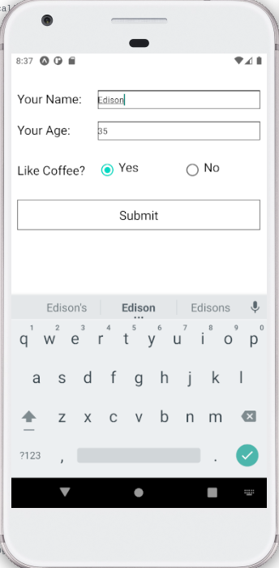
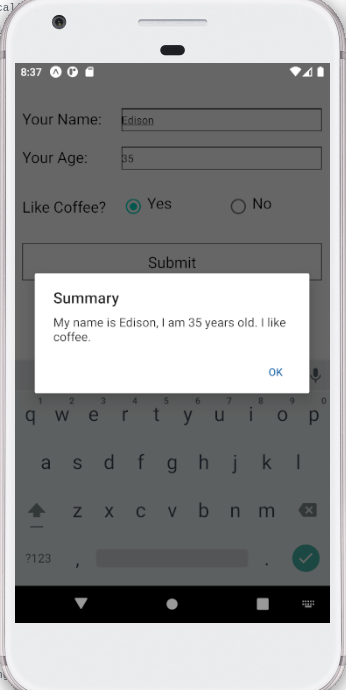

# React Native - Component and Layout : Assignment

## Brief

In this assignment, you are to create a simple form as shown below.

Upon submit button pressed, it should show an alert.

You may install external dependency from npmjs.com. You should be able to refer to documentation at [reactnative.dev](https://reactnative.dev/) to complete this task.

## Submission Guidelines

- Cite any relevant sources consulted during your research
- Solve the problems using your own code
- Do not copy and paste solutions from the source material
- Submit your assignment to black board.
