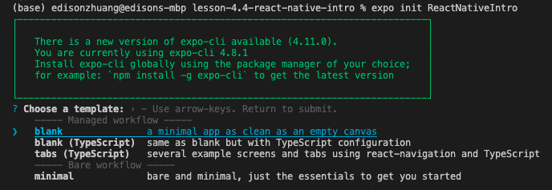
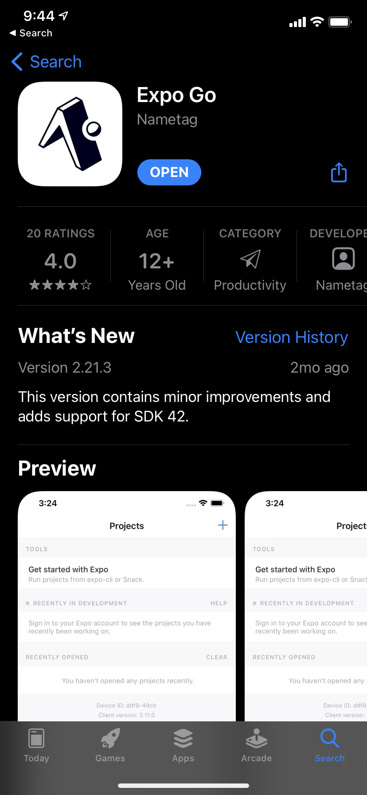
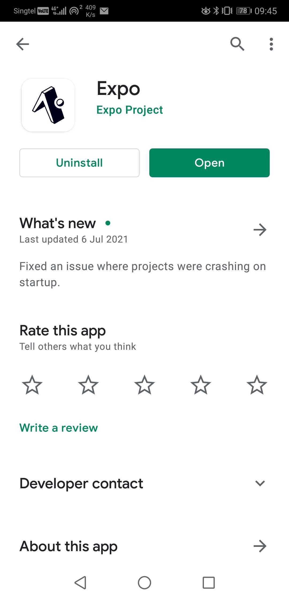
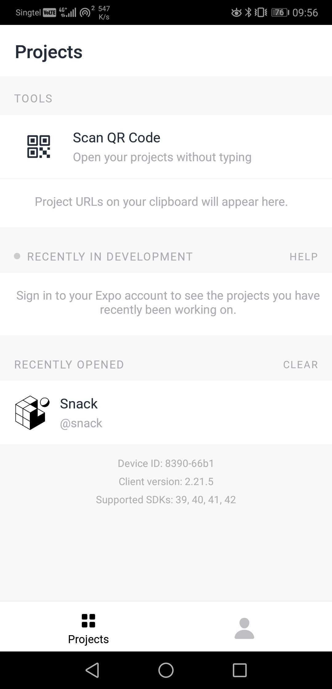
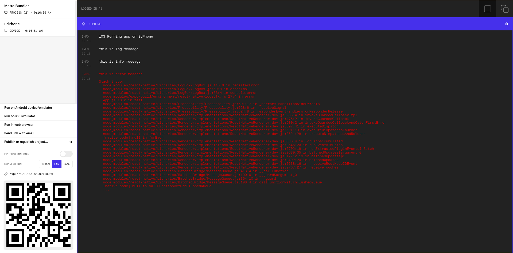
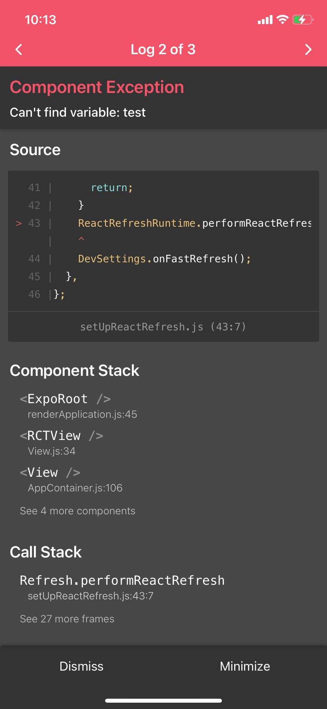

# Introduction to React Native

## Brief

In this lesson, we will setup a React Native project (and environment) together, inspect the project structure and launch a simple mobile application using Expo.

## Part 1 - Project Environment Setup

The following steps are excerpt from the official [environment setup guide](https://reactnative.dev/docs/environment-setup).

### Step 1: Install `expo-cli` on Terminal. 

```
npm install -g expo-cli
```

### Step 2: Initialize project folder

Change directory to this lesson's repository and run this command on terminal:

```
expo init ReactNativeIntro
```

You will be prompted to select an option. Choose the first option: `blank - a minimal app as clean as an empty canvas`.



### Step 3: Install Expo App (Android or iOS)

Go to your app store/google play to install this app on your mobile phone.

| App Store | Google Play |
|-----------|-------------|
|  |  |

### Step 4: Launch the App

Step 4.1: Change directory to `ReactIntroApp` folder and run this command on Terminal.

```
npm run start
```

or

```
yarn start
```

Step 4.2: Scan QR Code on browser with your phone (your browser should automatically launch with `http://localhost:19002/`)

If you are using Android, you might need an app like this:



After scanning the QR code, the `Expo Go` app will launch and you'll see something like this.


## Part 2 - About Console Logging & Debugging

If you attempt [google](https://www.google.com) for proper debugging in React Native and/or read the [react native debugger](https://github.com/jhen0409/react-native-debugger) repository, you'll learn that the debugging environment for React Native is not well supported in Windows and Linux platforms except for MacOS. Learners who are using MacBook can attempt install `react-native-debugger` via `brew`.

Let's attempt to create a button and observe some logging.

### Step 1 - Add these code

In the root directory of `ReactNativeIntro` project, open `./App.js`. Edit the code to reflect what you see here.

```js
import { StatusBar } from 'expo-status-bar';
import React from 'react';
import { StyleSheet, Text, View, TouchableOpacity } from 'react-native';

export default function App() {
  return (
    <View style={styles.container}>
      <Text>Open up App.js to start working on your app!</Text>
      <TouchableOpacity style={styles.button} onPress={test}><Text>Tap Me</Text></TouchableOpacity>
      <StatusBar style="auto" />
    </View>
  );
}

function test(){
  console.log("this is log message");
  console.info("this is info message");
  console.error("this is error message");
}

const styles = StyleSheet.create({
  container: {
    flex: 1,
    backgroundColor: '#fff',
    alignItems: 'center',
    justifyContent: 'center',
  },
  button: {
    alignItems: "center",
    backgroundColor: "#DDDDDD",
    padding: 10
  },
});

```

The app should now look like this.


### Step 2 - Observe the logs

Go back to your browser that is showing `http://localhost:19002/`, click on the your mobile device listed on the left.

On your mobile phone, you will see anew button "Tap Me". Tap it and observe logs being printed.



### Step 3 - Rename function from `test` to `test123`

Now, once the function is renamed, the button cannot find the reference to the function and hence throw another error on both your app and browser.

Error on console:
```
ReferenceError: Can't find variable: test

This error is located at:
    in App (created by ExpoRoot)
    in ExpoRoot (at renderApplication.js:45)
    in RCTView (at View.js:34)
    in View (at AppContainer.js:106)
    in DevAppContainer (at AppContainer.js:121)
    in RCTView (at View.js:34)
    in View (at AppContainer.js:132)
    in AppContainer (at renderApplication.js:39)
```

Error on app:

