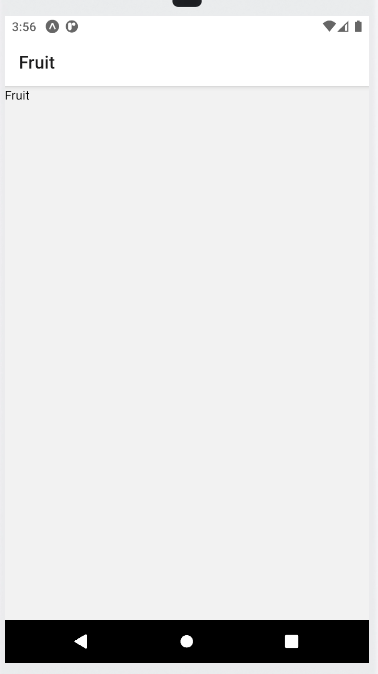
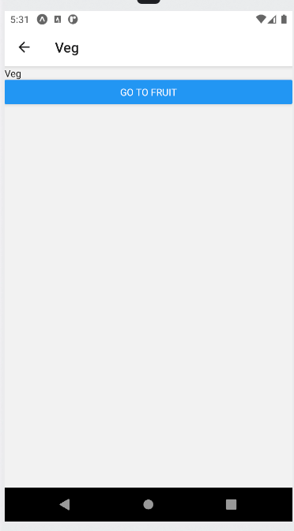
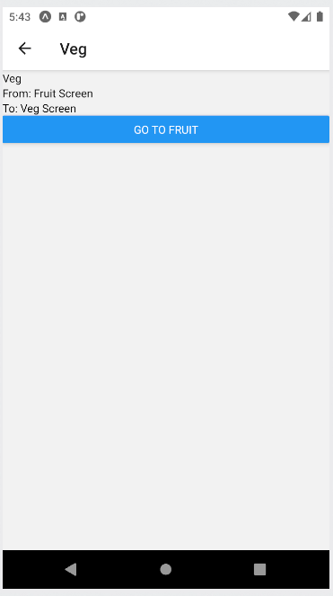

# React Navigation

In this lesson, if we have not introduced students to `yarn`, it will be a good time to do so.

Install yarn `npm install -g yarn`

## Part 1 - Create two screens

### Step 1: Create Project

Create a React Native project with `expo init NavApp` and choose blank template.

### Step 2: Install Dependencies

Install react native and navigation dependencies, run these commands on Terminal:

```
$ yarn add @react-navigation/native @react-navigation/native-stack
$ expo install react-native-screens react-native-safe-area-context
```

### Step 3: Write code for first screen

Your `App.js` should look like this:

```js
import React from "react";
import { StyleSheet, Text, View } from "react-native";
import { NavigationContainer } from "@react-navigation/native";
import { createNativeStackNavigator } from "@react-navigation/native-stack";

const FruitScreen = () => (
  <View>
    <Text>Fruit</Text>
  </View>
);

const VegScreen = () => (
  <View>
    <Text>Veg</Text>
  </View>
);

const Stack = createNativeStackNavigator();

export default function App() {
  return (
    <NavigationContainer>
      <Stack.Navigator>
        <Stack.Screen name="Fruit" component={FruitScreen} />
        <Stack.Screen name="Veg" component={VegScreen} />
      </Stack.Navigator>
    </NavigationContainer>
  );
}
```

This is the expected result. You will not see the `VegScreen` until we complete the next part.



## Part 2 - Navigate between them

Step 1: Provide a destructor and obtain the `navigation` object at each screen component.

```js
const FruitScreen = ({navigation}) => (/*...JSX...*/);

const VegScreen = ({navigation}) => (/*...JSX...*/);
```

Step 2: Add a button in each screen component.

FruitScreen

```js
<Button title="Go to Veg" onPress={() => navigation.navigate("Veg")}></Button>
```

VegScreen

```js
<Button
  title="Go to Fruit"
  onPress={() => navigation.navigate("Fruit")}
></Button>
```

The complete code of the screen components will look like this:

```js
const FruitScreen = ({ navigation }) => (
  <View>
    <Text>Fruit</Text>
    <Button
      title="Go to Veg"
      onPress={() => navigation.navigate("Veg")}
    ></Button>
  </View>
);

const VegScreen = ({ navigation }) => (
  <View>
    <Text>Veg</Text>
    <Button
      title="Go to Fruit"
      onPress={() => navigation.navigate("Fruit")}
    ></Button>
  </View>
);
```

Now, in your app, you should see buttons appear for both screens. Click on them to navigate back and forth.



## Part 3 - Pass data between screens

Quoting from [react navigation](https://reactnavigation.org/docs/params)

> Pass params to a route by putting them in an object as a second parameter to the navigation.navigate function: `navigation.navigate('RouteName', { /* params go here */ })`

> Read the params in your screen component: route.params.

Step 1: Pass data using second parameter

In FruitScreen component, modify the `<Button>` according to this line:

```js
<Button title="Go to Veg" onPress={() => navigation.navigate("Veg", { from: "Fruit Screen", to: "Veg Screen")}
></Button>
```

Step 2: Receive the data

Add `route` to the destructor in VegScreen, obtain data from `route.params` and print the data with JSX. The `VegScreen` component should look like this:

```js
const VegScreen = ({ route, navigation }) => { // add route to destructor
  const { from, to } = route.params; // obtain data
  return (
    <View>
      <Text>Veg</Text> 
      <Text>From: {from}</Text> 
      <Text>To: {to}</Text>
      <Button
        title="Go to Fruit"
        onPress={() => navigation.navigate("Fruit")}
      ></Button>
    </View>
  );
};
```



## Part 4 - Implement of `focus` and `blur` event life cycle via `useFocusEffect`.

The typical life cycle events of a component are:
- mount
- update (called `state` in react navigation)
- unmount

Screens bundled in the same stack are not unmount when hidden. Let's say you are looking at FruitScreen right now. Tapping on the button navigate you to VegScreen. When FruitScreen is hidden away, the unmount life cycle is not being triggered. If we want to trigger a function when a screen get pushed or hidden, we need to use the `focus` and `blur` event listener. 

Add this block of code within `VegScreen`:

```js
  useFocusEffect(
    React.useCallback(() => {
      const unsubscribe = () => console.log("blur");
      console.log('focus');
      return unsubscribe;
    }, [navigation])
  );
```

Now, when you toggle to and fro VegScreen, you will observe "focus" and "blur" being logged on console.