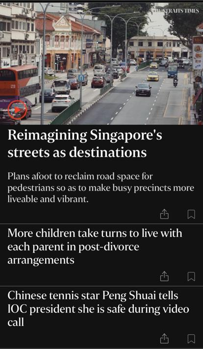
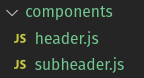

# Lesson 4.7 - React Native Tailwind CSS

## Brief

In this lesson, learners will be exposed to writing CSS Styling natively and comparing it against the use of Tailwind CSS (for React Native). Tailwind CSS is created for web based and there are several contributors adapted it for React Native (excerpt from this [link](https://blog.bitsrc.io/5-reasons-to-use-tailwind-css-with-react-native-1e7999c40b2e)). They are:

1. tailwind-react-native-classnames
1. react-native-tailwindcss
1. react-native-tailwind
1. tailwind-rn

In this lesson, we will be using `tailwind-rn` library.

> Note: Most of the elements mentioned in the Tailwind CSS documentation are not applicable for React Native. Hence, you need to pay extra attention when using Layouts, Flexboxs, Spacing, Sizing, Typography, Background, Borders in your React Native components.

This lesson also acts as a preparation milestone to help learners acquainted with Tailwind CSS so that they can appreciate the following lesson where a UXPM Instructor will be teaching from UX's perspective.

Instructor(s) are to apply I DO and WE DO framework in Part 1, 2, 3 and 4.

## Part 1 - Create a basic UI with native styling (30 mins)

In this part, we will attempt to replicate a simple news feed homepage from straits time.



> Disclaimer: The outcome will not be identical.

### Step 1: Create a RN app

Generate a RN app using `expo init newsfeed-app`.

### Step 2: Delete the generated .git folder

```shell
$ sudo rm -rf ./.git
```

### Step 3: Create a `components` folder with two JS files

Create "components" folder in "newsfeed-app` project folder. Create two JS files and name them accordingly:

- header.js
- subheader.js



### Step 4: Code header.js

Your `header.js` should look like this:

```js
import React from 'react';
import { StyleSheet, Text, Image, View, Dimensions } from 'react-native';

const windowWidth = Dimensions.get('window').width;
const windowHeight = Dimensions.get('window').height;

const Header = ({imgUrl, text, descText}) => {
    return (
        <View style={styles.container}>
            <Image style={styles.headerImage} source={{uri:imgUrl}}></Image>
            <Text>{text}</Text>
            <Text>{descText}</Text>
        </View>
    );
}

const styles = StyleSheet.create({
    container: {
      flex: 1,
      alignItems: 'center',
      justifyContent: 'center',
    },

    headerImage:{
        width:windowWidth,
        height:windowHeight / 4,        
    },
  });

  
export default Header;
```

### Step 5: Code subheader.js

Your `subheader.js` should look like this:

```js
import React from 'react';
import { StyleSheet, Text, Image, View, Dimensions } from 'react-native';

const windowWidth = Dimensions.get('window').width;

const SubHeader = ({text}) => {
    return(
        <View style={styles.container}>
            <Text>{text}</Text>
        </View>
    )
}

const styles = StyleSheet.create({
    container: {
        flex: 1,
        alignItems: 'center',
        justifyContent: 'center',  
      },
  });

export default SubHeader;
```

### Step 6: Modify App.js

Your `App.js` should look like this:

```js
import { StatusBar } from 'expo-status-bar';
import React from 'react';
import { StyleSheet, Text, View, ScrollView, SafeAreaView} from 'react-native';
import Header from "./components/header";
import SubHeader from "./components/subheader";

export default function App() {
  return (
    <SafeAreaView>    
      <ScrollView contentConstainerStyle={styles.container}>
        <Header text="Vaccinations coverage above 80%" imgUrl="https://encrypted-tbn0.gstatic.com/images?q=tbn:ANd9GcQZdr18OjYKxxBxfzNyPpZxHxIDBmGuqg9QNw&usqp=CAU" descText="This is a description text that shows the summary of what this article is talking about."></Header>
        <SubHeader text="More children take turns to live with each parent in post-divorce arrangements"></SubHeader>
        <SubHeader text="Chinese tennis star Peng Shuai tells IOC president she is safe during video call"></SubHeader>
        <SubHeader text="Chinese tennis star Peng Shuai tells IOC president she is safe during video call"></SubHeader>
      </ScrollView>
    </SafeAreaView>
  );
}

const styles = StyleSheet.create({
  container: {
    flex: 1,
    backgroundColor: '#fff',
    alignItems: 'center',
    justifyContent: 'flex-start',
  },
});

```

Run the app and expect the following outcome:


## Part 2 - Applying Native Styling

The Part 1, we have created a the app without styling. In this part, both instructor(s) and learners may concurrently attempt input styling code to arrive at this outcome:


After the attempt, check out the respective files for "answer" code.

- [header.js](./newsfeed-app/components/header.js)
- [subheader.js](./newsfeed-app/components/subheader.js)

## Part 3 - Tailwind CSS 

In this part of the exercise, attempt to refactor the existing code to utilize [tailwind-rn](https://www.npmjs.com/package/tailwind-rn).

Refer to this [link](https://tailwindcss.com/docs) for the exact css terms to use. 

> Reminder: Most of the elements mentioned in the Tailwind CSS documentation are not applicable for React Native. Hence, you need to pay extra attention when using Layouts, Flexboxs, Spacing, Sizing, Typography, Background, Borders in your React Native components.
